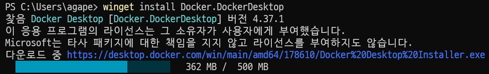
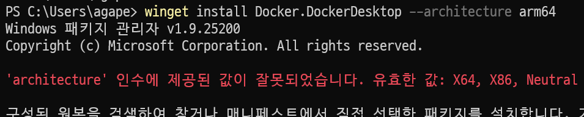
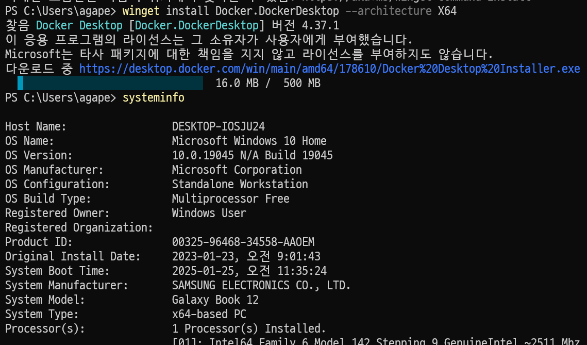

# 윈도우에서 도커 설치하려다가 시간 낭비한 일

내가 사용하는 갤럭시북이 태블릿이다 보니 별 생각없이 arm cpu일 거라고 생각하고 시간 낭비하는 일이 발생했다.



winget으로 설치 명령을 실행했는데 download url이 amd64로 되어 있어서, (arm이라고 생각하고 있었으니) 왜 제대로 된 걸 받지 못하지? 하면서 실행을 중지하고, 검색을 해보니 settings 명령어를 통해 architecture를 설정할 수 있다는 걸 확인하고, 설정을 수정했다.
https://learn.microsoft.com/ko-kr/windows/package-manager/winget/settings

그러나 여기 나온 걸 copy & paste하니 대부분 그렇듯 문제가 발생했고, 설정이 잘못되었다는 안내가 나왔다. 검색을 몇 번 하다가 귀찮아서 chatgpt에게 물어보니 다음과 같이 고치라고 알려줬다.


```
{
    "$schema": "https://aka.ms/winget-settings.schema.json",

    // For documentation on these settings, see: https://aka.ms/winget-settings
    // "source": {
    //    "autoUpdateIntervalInMinutes": 5
    // },
    "installBehavior": {
        "preferredArchitecture": "arm64"
    }
}
```

https://chatgpt.com/c/67945ac5-d8e8-8001-ac05-2911b8d61d00

이걸로 다시 winget settings를 실행하고 수정하고 확인해보니 이제 오류 메시지가 발생하지 않았다. 하지만 다시 해봐도 여전히 amd64 주소로 받아와서 또 뭘 잘못 입력했나? 생각하다보니 이 정도 문제가 발생했다면 내가 뭔가 착각하고 있다는 생각을 하고, systeminfo로 확인해보니 내 갤럭시북은 intel cpu였다. 결국 시간낭비를 하고 괜히 정상 동작하는 winget을 방해하고 있던 것…



그래도 한 가지 매우 작은 소득은 winget settings에 대해 아주 조금 더 알게 되었다는 점 정도
