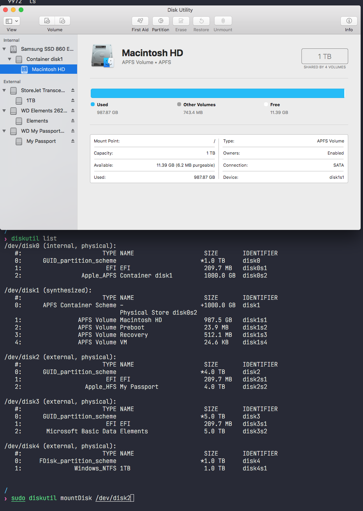

# Mac에서 외장 하드 디스크를 인식하지 못 하는 경우

(위 screenshot은 해결이 된 후라 모두 정상 인식하는 경우이나 문제가 있는 경우 당연히 회색으로 글씨가 표시되고 클릭해보면 정상 인식할 수 없다고 표시)

데이터를 잃지 않기 위해서는 다음 두 가지 방법이 있다.
1. Disk Utility
    - 문제가 있는 disk에서 마우스 오른쪽 버튼을 눌러보면 나오는 menu중 `Run First Aid...` 실행
    - 위의 명령이 정상적으로 실행 가능한 경우 그 뒤에 `Mount` 실행
2. (1번 Disk Utility 이용하는 방법이 정상적으로 되지 않는 경우) terminal을 실행하고
    - `diskutil list` 실행
        - 여기서 list에 원하는 disk가 나오지 않으면 hardware 문제일 가능성이 높음
    - `sudo diskutil mountDisk /dev/diskN` (N은 문제가 발생한 disk number) 실행

위 두 가지 방법으로도 안 되는 경우 (나는 실제로 해보지는 않았지만 검색 등을 통해 찾아보면 나오는 방법)
1. 데이터를 잃어도 괜찮다면 Disk Utility의 `Restore`를 해보거나 디스크를 포맷
2. 데이터를 그래도 사용해야 한다면
    - 데이터 복구 프로그램 실행(유료 무료)
    - 유료라도 데이터 복구 업체 연락