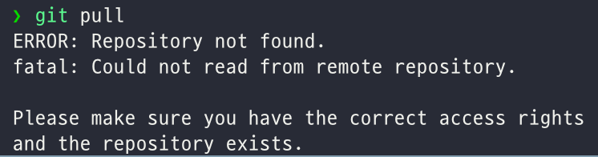
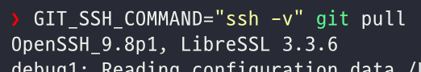

# ERROR: Repository not found. (git repository가 remote repository와 정상 연결되지 않는 경우)



```
❯ git pull
ERROR: Repository not found.
fatal: Could not read from remote repository.

Please make sure you have the correct access rights
and the repository exists.
```

## 1

GitHub에서 ERROR: Repository not found.가 발생하는 가장 흔한 원인은 “리모트 URL이 잘못되었거나”, “레포지토리가 이전(이름/경로 변경, 오너 변경 등)된 경우”입니다. 아래 과정을 순서대로 확인해보세요.

1. 리모트 URL 확인하기

먼저 현재 설정되어 있는 리모트 URL을 확인합니다.

`git remote -v`

출력 예시:

```
origin  git@github.com:old-user/old-repo-name.git (fetch)
origin  git@github.com:old-user/old-repo-name.git (push)
```

위와 같이 origin이 가리키는 주소가 실제로 존재하지 않거나 이름이 바뀐 저장소라면, “Repo not found” 에러가 발생합니다.

2. GitHub에서 실제 레포지토리 주소 확인
	- GitHub 웹사이트에서 해당 프로젝트(혹은 현재 작업하고자 하는 프로젝트)를 찾아봅니다.
	- URL이 기존 것과 달라졌는지(예: old-repo-name → new-repo-name, old-organization → new-organization) 확인하세요.
	- 레포지토리가 private으로 변경되었거나, 권한 설정이 달라졌는지 확인합니다.
	- 정말로 저장소가 존재하고, 본인(또는 해당 SSH 키)에게 권한이 있는지 확인합니다.

3. 리모트 URL 재설정하기

리모트 URL이 변경되었다면 아래와 같이 수정합니다.

```
# 새로운 저장소 주소로 교체
git remote set-url origin git@github.com:<username>/<repository>.git

# 제대로 설정되었는지 다시 확인
git remote -v
```

리모트가 제대로 잡혀 있다면, 이제 다시 git pull을 시도해봅니다.

4. 그래도 안될 때 추가 확인 사항
	1.	SSH 키 충돌 또는 권한 문제
		- ssh -T git@github.com 명령으로 “successfully authenticated” 등의 메시지를 받는다면, 적어도 GitHub과의 SSH 연결 자체는 문제가 없다는 의미입니다.
		- 혹시 여러 개의 SSH 키를 사용 중이라면, 현재 프로젝트에 적용되는 키가 맞는지(SSH config 확인) 살펴보세요.
	2.	Git 계정 설정 확인
		- 터미널에서 git config user.name, git config user.email이 정상적으로 설정되어 있는지 확인합니다.
		- GitHub 계정과 충돌이 나는 다른 사용자 정보가 설정되어 있지 않은지도 체크합니다.
	3.	조직(Organization) 권한 확인
		- 조직에 속해 있던 저장소라면, 해당 조직에서 탈퇴되거나 권한이 변경되지는 않았는지 확인합니다.
		- 만약 조직 저장소 URL을 개인 저장소 URL로 바꾸었다면, 실제로 그 레포지토리는 조직 쪽이 아닌 개인 계정에 있어야 합니다.

결론

1.	로컬 Git의 리모트 URL이 실제로 존재하는 레포지토리를 가리키고 있는지(이름/조직 경로가 바뀌지 않았는지) 확인합니다.
2.	SSH 키와 권한에 이상이 없는지 확인합니다.
3.	문제가 되는 부분을 수정했다면, git remote set-url origin <올바른 주소> 커맨드로 리모트를 재설정 후 다시 git pull을 시도합니다.

이 과정을 통해서 보통은 “Repository not found” 에러를 해결할 수 있습니다. 만약 여전히 문제가 발생한다면, GitHub 프로젝트에 대한 접근 권한이 제대로 부여되어 있는지 다시 한 번 점검해보세요.

## 2

이미 리모트 URL, 권한, SSH 설정 등 기본적인 부분들을 모두 점검했는데도 해결되지 않는다면, 아래와 같은 추가 방법들을 시도해볼 수 있습니다.

1. 깔끔하게 새 클론으로 테스트하기

가장 확실하게 문제를 분리할 수 있는 방법 중 하나는 새 폴더에서 같은 리포지토리를 다시 클론해 보는 것입니다.

	1.	임시 디렉터리를 만듭니다.
	2.	해당 디렉터리 안에서 git clone git@github.com:username/repo.git (혹은 올바른 주소) 명령을 실행해봅니다.
	3.	정상적으로 클론이 된다면, 로컬에서 사용하던 설정(혹은 로컬 레포지토리)에 문제가 있는 것일 수 있습니다.
	4.	만약 새로 클론 시도도 불가능하다면, 실제로 해당 리포지토리에 대한 접근 권한 문제나 저장소 자체가 사라졌을 확률이 높습니다.

이 과정을 통해 **“로컬 Git 설정/리포지토리 문제가 아니라, 진짜 리포지토리나 권한 문제가 있는지”**를 분리해서 확인할 수 있습니다.

2. SSH 연결 로그 자세히 보기

ssh -T git@github.com 명령으로 대화형 연결 자체는 가능하다고 해도, Git이 내부적으로 다른 SSH 키나 다른 설정을 사용하고 있을 수 있습니다.
다음과 같이 SSH를 verbose 모드로 실행하여, 어떤 SSH 키를 사용 중인지 로그를 확인해보세요.



`GIT_SSH_COMMAND="ssh -v" git pull`

이 명령을 실행하면, SSH 접속 과정에서 어떤 공개키가 사용되고, 어떤 이유로 인증이 성공/실패되는지 상세 로그가 터미널에 표시됩니다.
- 혹시 여러 개의 SSH 키를 사용하는 환경에서, 원하는 SSH 키가 아닌 다른 키가 선택되고 있을 수도 있습니다.
- ~/.ssh/config 파일을 사용 중이라면, Host github.com 아래 부분에 IdentityFile이 잘 설정되어 있는지 확인해보세요.

3. GitHub 개인 설정 (SSH 키, 권한, 조직)
	1.	GitHub 웹에 들어가서 [Settings > SSH and GPG keys](https://github.com/settings/ssh) 에서 현재 등록된 SSH 키 목록을 확인합니다.
		- 혹시 예전 키가 삭제되었거나, 새롭게 등록해야 할 키가 있다면 업데이트하세요.
	2.	만약 조직(Organization) 리포지토리라면, 조직 내에서 자신의 권한이 “Write” 이상으로 설정되어 있는지 다시 한 번 확인하세요.
		- 조직에서 탈퇴되었거나, 권한이 줄어들었다면 ERROR: Repository not found. 메시지가 뜨기도 합니다.

4. 저장소가 정말로 존재하는지 2차 확인
	1.	GitHub 웹 브라우저에서 해당 저장소 URL(예: https://github.com/username/repo)에 직접 접속해서 404가 뜨는지 확인합니다.
		- 저장소가 삭제되었거나 개인이 소유한 포크가 사라진 경우, 로컬 Git 정보가 남아 있어도 pull이 불가능합니다.
	2.	레포지토리 이름/소유자가 변경된 적이 없다면, 혹은 포크가 원본에 병합되어 없어졌는지(포크 저장소를 실수로 삭제한 경우) 여부도 점검해야 합니다.

5. 로컬 설정 깨끗이 정리하기

그래도 계속 문제가 생긴다면, 다음을 시도할 수 있습니다:

	1.	기존 origin을 제거하고, 다시 연결

        ```
        git remote remove origin
        git remote add origin git@github.com:username/repo.git
        git fetch origin
        git checkout main
        git pull
        ```

	2.	git config --list로 현재 레포지토리(혹은 글로벌)에서 설정된 내용을 확인하고, 필요 없는 설정 항목을 정리합니다.
		- 예: 다른 credential helper 사용 흔적, 오래된 user name/email, 특정 proxy 설정 등

6. HTTPS로 시도해보기 (임시 확인용)

SSH 접근이 계속 막힐 경우, 혹은 SSH 설정 문제인지 확인하려면 HTTPS로 클론/리모트 변경을 시도해볼 수도 있습니다.

```
git remote set-url origin https://github.com/username/repo.git
git pull
```

	- 만약 HTTPS로는 정상 접근이 된다면, SSH 설정(키, config, 권한 등)에 문제가 있다는 의미입니다.
	- HTTPS도 안된다면, 권한 문제나 저장소가 실제로 없는 경우일 확률이 높습니다(또는 사내 네트워크 문제 등).

결론

이미 기본적인 SSH 권한/리모트 URL 점검을 마쳤는데도 해결되지 않는다면,

	1.	새 폴더에서 클론 테스트 → 실제 접근 가능한지 분리 확인
	2.	SSH verbose 모드로 어떤 키가 사용되는지 확인
	3.	GitHub 설정(SSH key, 조직 권한, 저장소 존재 여부) 재검토
	4.	HTTPS로 시도하여 SSH 설정 문제인지 분리

이런 단계를 거치면 대부분의 원인을 찾을 수 있습니다. 그래도 문제를 해결하지 못한다면, 해당 리포지토리에 대한 접근 권한/실존 여부를 다시 한 번 확인하거나, SSH 키 설정이 꼬인 부분을 초기화한 뒤 새로 등록해보는 방법을 시도해 볼 수 있습니다.

## 3

`GIT_SSH_COMMAND="ssh -v" git pull` 실행 시 log에서 SSH가 known_hosts2 파일을 찾는 것은 정상 동작 과정 중 하나입니다. 기본적으로 OpenSSH는 known_hosts 외에도 known_hosts2 파일을 추가로 읽을 수 있도록 구현되어 있습니다. 만약 해당 파일이 없으면 단순히 “파일이 없다”는 로그가 뜨고, 그 다음 단계(다른 파일 로드, 새로 생성 등)를 진행합니다.

즉, 로그 메시지 자체는 “에러”가 아닌 일반적인 정보일 뿐이고, known_hosts2 파일이 없다고 해서 SSH 연결이 실패하거나 Git 작업에 문제가 생기는 것은 아닙니다.

왜 known_hosts2를 찾는 로그가 뜰까?
- OpenSSH는 내부적으로 known_hosts 파일뿐만 아니라 known_hosts2 파일도 확인할 수 있도록 설계되어 있습니다.
- 대부분의 최신 환경에서는 known_hosts만 주로 사용하고, known_hosts2가 생성되지 않는 경우가 많습니다.
- 만약 파일이 없다면, “No such file or directory”라고 단순히 로그를 출력하고 넘어갑니다.

굳이 수정하거나 없애고 싶다면?

1.	파일을 그냥 만들어 주기

`touch ~/.ssh/known_hosts2`

이렇게 하면 해당 로그가 뜨지 않을 수 있지만, 사실상 내용이 필요 없다면 굳이 만들 이유도 없습니다.

2.	SSH 설정 파일에서 known_hosts2 경로 확인
    - 일부 환경에서는 /etc/ssh/ssh_config 혹은 ~/.ssh/config에서 UserKnownHostsFile을 별도로 설정해 둔 경우가 있습니다.
    - 만약 UserKnownHostsFile 옵션에 known_hosts2가 명시되어 있으면, 해당 줄을 주석 처리하거나 제거해도 됩니다. 그러나 보통은 시스템 기본값을 쓰며, 별도 설정 없이도 SSH가 자동으로 known_hosts2를 탐색하는 경우가 많습니다.

결론

	- known_hosts2 파일을 찾지 못했다는 로그는 정상 동작이며, SSH가 추가적인 호스트 정보를 읽을 파일을 탐색만 했을 뿐입니다.
	- 이 메시지로 인해 SSH 연결이나 Git 작업이 실패하는 것은 아니므로, 별도의 문제 해결이 필요하지 않습니다.
	- 여전히 “Repository not found” 이슈가 지속된다면, known_hosts2 로그 메시지와는 무관하므로, SSH 권한, 원격 URL, 레포지토리 권한 등을 다시 살펴봐야 합니다.

## 4

SSH 에이전트(ssh-agent)에는 여러 개의 키를 동시에 등록할 수 있습니다. 즉, 개인용 키와 회사용 키를 모두 등록해 두는 것도 가능합니다. 다만, GitHub에서 **동일 호스트(github.com)**로 접근할 때 어떤 키를 사용할지 결정하는 것은 결국 ~/.ssh/config 설정으로 제어해야 합니다.

아래 내용을 요약하면:
1.	SSH 에이전트: 여러 키(personal_key, company_key)를 등록 가능
2.	.ssh/config: 어떤 호스트(혹은 별칭)로 접속할 때 어느 키를 우선 사용할지 정의
3.	Git 리포지토리 remote URL: 각 프로젝트마다, 위에서 설정한 호스트(또는 별칭)로 접근하도록 지정

1) 여러 키를 에이전트에 등록하기

터미널에서 다음 명령으로 원하는 키들을 추가할 수 있습니다.

### 개인 키 등록
`ssh-add ~/.ssh/id_ed25519_personal`

### 회사 키 등록
`ssh-add ~/.ssh/id_ed25519_company`

### 등록된 키 확인
`ssh-add -l`

이렇게 하면 ssh-add -l 목록에 두 개 키가 모두 나오게 됩니다.

	Tip: macOS나 Linux에서는 로그인할 때 자동으로 ssh-agent를 시작하고, .ssh/config의 AddKeysToAgent yes를 통해 자동 등록할 수도 있습니다.

2) .ssh/config에서 호스트 별칭 설정하기

GitHub는 도메인이 전부 github.com으로 동일하므로, 동일 호스트이지만 다른 키를 써야 하는 상황에서 가장 많이 사용하는 방법이 “Host 별칭(alias)”입니다.

예시로, ~/.ssh/config에 아래와 같이 설정해볼 수 있습니다.

### 회사용

```
Host github-company
    HostName github.com
    User git
    IdentityFile ~/.ssh/id_ed25519_company
    IdentitiesOnly yes
```

### 개인용

```
Host github-personal
    HostName github.com
    User git
    IdentityFile ~/.ssh/id_ed25519_personal
    IdentitiesOnly yes
```

위 설정은 “github-company”라는 가상의 호스트 이름으로 접속할 때는 회사 키를, “github-personal”이라는 가상의 호스트 이름으로 접속할 때는 개인 키를 사용하도록 지정합니다.

3) Git 리모트 주소에 별칭 적용

이제 각 프로젝트(디렉터리)에서, 어떤 호스트 별칭을 사용할지 정하면 됩니다.

	- 개인용 프로젝트에서:

		```
		cd ~/my-personal-project
		git remote set-url origin git@github-personal:내_아이디/개인_레포.git
		```

	- 회사용 프로젝트에서:

		```
		cd ~/company-project
		git remote set-url origin git@github-company:회사_조직/회사_레포.git
		```


이렇게 해두면, 해당 디렉터리에서 git pull, git push 등을 실행할 때마다, Git이 github-personal 혹은 github-company 별칭을 보고 각각 다른 키를 사용하게 됩니다.

	참고로, 일반적으로는 git@github.com:조직/레포.git 형태인데, 우리가 ~/.ssh/config에서 Host github-company를 github.com 대신 쓰도록 했으므로, 리모트 URL에서 도메인 부분만 github-company로 바뀐 것입니다.

4) “기본” 설정과 “별칭” 동시 사용

만약 “개인 계정은 GitHub 기본 주소로 쓰고, 회사 계정만 별칭을 쓰겠다”는 식이라면, 다음처럼도 설정할 수 있습니다:

### 기본적으로 github.com 접속 시에는 개인 키 사용

```
Host github.com
    User git
    IdentityFile ~/.ssh/id_ed25519_personal
    IdentitiesOnly yes
```

# 회사 프로젝트용 별칭

```
Host github-company
    HostName github.com
    User git
    IdentityFile ~/.ssh/id_ed25519_company
    IdentitiesOnly yes
```

그럼 개인용 프로젝트는 git@github.com:username/repo.git 그대로 두고, 회사 프로젝트만 git@github-company:org/repo.git 형태로 쓰면 됩니다.

5) 주의사항: 우선순위와 IdentitiesOnly

	- IdentitiesOnly yes를 사용하면, SSH 에이전트에 등록되어 있더라도, 해당 Host 설정에 명시된 키만 사용합니다.
	- 만약 IdentitiesOnly를 쓰지 않으면, 설정된 키 외에도 에이전트에 등록된 키들이 추가로 시도될 수 있습니다.
	- 이 경우, 원치 않는(접근 권한이 없는) 계정으로 연결될 수 있으니 주의가 필요합니다.
	- 여러 프로젝트에서 각기 다른 계정(SSH 키)으로 접속해야 한다면, 위와 같이 Host 별칭을 쓰는 것이 가장 깔끔합니다.

정리

	1. **ssh-add**로 회사 키와 개인 키 둘 다 등록할 수 있습니다.
	2. **~/.ssh/config**에서 Host 별칭을 나누어, 각 호스트(별칭)에 다른 키를 지정하면 됩니다.
	3. 각 Git 리포지토리마다 리모트 URL을 해당 별칭으로 설정해두면, 자동으로 올바른 키를 사용합니다.

이렇게 세팅하면 디렉터리(프로젝트)마다 구분 없이도, “리모트 설정만 달라진 것”으로 회사/개인 계정 키를 동시에 문제없이 사용할 수 있을 것입니다.
