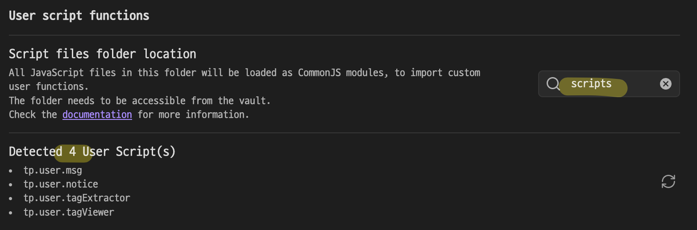
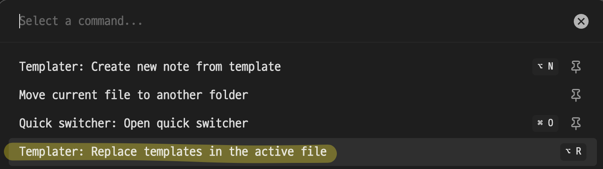

# Obsidian plugin - templater (+ ChatGPT 삽질기)

Obsidian을 쓰면서 `tasks`, `query`나  `dataview`를 사용해 내가 보기 원하는 tag를 모아보기는 했지만, 불편한 점이 있었다. 그러다가 templater plugin의 user scripts를 통해 조금 더 원하는 형태로 가공을 할 수 있을 거라고 생각했지만, javascript로 뭔가 하기 귀찮다는 생각에 내버려두다가, ChatGPT를 통해 만들어야겠단 생각을 했다. 몇 차례 질문을 하니 다음과 같은 code를 작성해줬고, 아직까진 원하는 형태로 잘 보여줘서 만족하고 Obsidian note에 넣고 사용하기 시작했다.

````jsx
```dataviewjs
// 블록 ID 추출용 정규 표현식
const blockIdRegex = /\^([a-zA-Z0-9\-]+)/;

const targetTag = "#tag/I/want/to/use";
const pages = dv.pages(targetTag).sort(p => p.file.name, 'desc');

for (let page of pages) {
    const content = await dv.io.load(page.file.path);
    const lines = content.split("\n");

    const matchedLines = lines
        .map((line, idx) => ({line, idx}))
        .filter(item => item.line.includes(targetTag));

    if (matchedLines.length > 0) {
        dv.header(4, dv.fileLink(page.file.path));
        matchedLines.forEach(item => {
            const blockMatch = item.line.match(blockIdRegex);
            if (blockMatch) {
                const blockId = blockMatch[1];
                const link = dv.el('a', item.line.trim(), {
                    attr: {
                        href: page.file.link + "#^" + blockId
                    }
                });
                dv.paragraph(link);
            } else {
                // 블록 ID가 없는 경우 경고메시지 출력
                dv.paragraph(`(No block ID) ${item.line.trim()}`);
            }
        });
    }
}
```
````

하지만, 바로 생각해보니 이 코드를 매번 내가 필요로 하는 note마다 copy & paste를 하는 건 매우 불편하고 비효율적인 일이었다. 내가 원하는 건 단지 tag를 사용해 관련된 filename과, tag가 포함된 line을 보기 원하는 것 뿐이었기 때문에, 따로 function을 만들고 여기에 내가 원하는 tag만 호출하는 게 당연히 합리적인 일이었다. 잠시 검색해보니 templater plugin의 user scripts가 이 역할을 한다는 걸 알 수 있었다.

https://silentvoid13.github.io/Templater/user-functions/script-user-functions.html

programming의 시작은 Hello World. user scripts의 설명도 msg를 출력하는 function을 정의하고 obsidian note에서는 function에 msg argument만 전달해서 출력해보는 예제부터 알려준다. Obsidian vault의 root directory에 scripts란 directory를 만들고 그 안에 msg.js란 javascript file을 만들었다(주의: Obsidian에서 file을 만들면 자동으로 .md 확장자가 붙어 msg.js.md로 생성되므로 terminal에서 만들어야 한다)

```jsx
function my_function (msg) {
    return `Message from my script: ${msg}`;
}
module.exports = my_function;
```

Obsidian의 templater plugin에서 해당 script가 제대로 인식이 되면 0이 아니라, scripts directory에 있는 .js file 갯수만큼 표시가 된다. scripts directory만 만들고 templater plugin을 확인해보면 처음에는 “Detected 0 User Script(s)”라고 나온다.



이제 Obsidian note에서 다음과 같은 templater command를 입력하고

`<% tp.user.msg("Hello World!") %>`

다음 command를 실행하면



Obsidian note에서 `Message from my script: Hello World!` text를 볼 수 있다.

그럼 이제 function body만 내가 원하는 걸로 바꾸고 호출만 하면 되겠지? 라고 생각했다. 다음과 같은 javascript file을 scripts/tagExtractor.js로 저장했다.

```jsx
// 공통 함수 정의
async function extractTaggedBlocks(dv, tag) {
    const blockIdRegex = /\^([a-zA-Z0-9\-]+)/;
    const pages = dv.pages(tag).sort(p => p.file.name, 'desc');

    for (let page of pages) {
        const content = await dv.io.load(page.file.path);
        const lines = content.split("\n");

        const matchedLines = lines
            .map((line, idx) => ({line, idx}))
            .filter(item => item.line.includes(tag));

        if (matchedLines.length > 0) {
            dv.header(4, dv.fileLink(page.file.path));
            matchedLines.forEach(item => {
                const blockMatch = item.line.match(blockIdRegex);
                if (blockMatch) {
                    const blockId = blockMatch[1];
                    const link = dv.el('a', item.line.trim(), {
                        attr: {
                            href: page.file.link + "#^" + blockId
                        }
                    });
                    dv.paragraph(link);
                } else {
                    dv.paragraph(`🔸 (블록 ID 없음) ${item.line.trim()}`);
                }
            });
        }
    }
}

// 외부에서 사용하기 위해 export
module.exports = extractTaggedBlocks;
```

하지만 대부분 그렇듯 다음 단계를 갈 때는 바로 진행이 되지 않았다. 문서를 읽기 귀찮아서 그냥 검색만 하면서 대충 copy & paste로 해보려고 했지만, 전혀 동작하지 않았다. 그것마저 하기 싫어서 결국 ChatGPT의 도움을 받기 시작했다. (문서만 천천히 읽었으면 몇 분이면 알았을) async 함수를 호출하는 command가 다르다는 점부터 시작해 여러가지를 ChatGPT에게 맡기려다보니 오히려 시간을 낭비하게 되었다. 여기서 괜히 ChatGPT를 붙잡고 늘어졌던 이유는 이미 잘 알려졌듯이 ChatGPT는 자신이 생성한 답변이 맞고 틀린지를 전혀 모르기 때문에 ‘자신있게’ 계속 생성을 하지만, 결국 그 검증은 사람(나)이 해야 하니 오히려 짜증이 나서 더 물어보게 되었던 것이었다. ChatGPT가 생성해준 다양한 오답들의 일부이다.

`<%* tp.user.tagExtractor(dv, "#manta") %>`

```jsx
// 최종정답 (2024년 현재 최신 버전 확정)
const templater = app.plugins.plugins["templater-obsidian"].templater;
await templater.user_scripts_folder.scripts["tagExtractor"](dv, "태그명");
```

`<%*
await dv.view("scripts/tagViewer", { tag: "#manta/process/planning/2025Q2" });
_%>`

```jsx
const tagExtractor = await dv.io.load("scripts/tagExtractor.js");
await tagExtractor.extractTaggedBlocks(dv, "태그명");
```

```jsx
const templater = app.plugins.plugins["templater-obsidian"].templater;
await templater.current_functions_object.scripts["tagExtractor"](dv, "태그명");
```

그 외에도 굉장히 많은데 검색을 활성화하고 사용해서 그런지 ChatGPT는 위의 예처럼 “최종정답”이라거나, “이번에는 확실합니다”같은 말을 사용하며 100% 자신감 가득한 오답을 계속 제공했고, 대략 3시간을 매달리다가 결국 포기하고 잠에 들었다.

다음날 일을 마친 후, 다시 한번 테스트해봐야지 하는 생각에 우선 templater object가 존재하는지부터 검사하기 시작했다.

````jsx
```dataviewjs
const templater = app.plugins.plugins["templater-obsidian"].templater;

dv.paragraph("Templater 플러그인 내 객체 점검:");

dv.list([
    `templater.userFunctions: ${!!templater.userFunctions}`,
    `templater.user_scripts: ${!!templater.user_scripts}`,
    `templater.functions: ${!!templater.functions}`,
    `templater.user_functions: ${!!templater.user_functions}`,
]);
```
````

위와 같이 Obsidian note에 입력하면 모두 false를 출력한다. templater에 존재하는 object는 뭐가 있을까? 찾아보니 `templater.current_functions_object`가 존재한다는 사실을 알 수 있었다. 혹시? 하는 생각과 함께 이번엔 어제 하듯이 온갖 정보를 넣고 질문하지 않고 간단하게 다음과 같이 물어봤다.

```jsx
What kinds of objects are existing inside of templater.current_functions_object in templater plugin of obsidian?
```

답변을 보니 이 안에 user가 존재한다는 걸 알 수 있었고, 바로 다음 질문을 했다

```jsx
Then how to use user script with templater.current_functions_object.user?
```

여기까지 오니 문제는 거의 해결이 되었다. 

````jsx
```dataviewjs
const templater = app.plugins.plugins["templater-obsidian"].templater;

dv.paragraph("Templater 플러그인 내 객체 점검:");

dv.list([
    `templater.userFunctions: ${!!templater.userFunctions}`,
    `templater.user_scripts: ${!!templater.user_scripts}`,
    `templater.functions: ${!!templater.functions}`,
    `templater.user_functions: ${!!templater.user_functions}`,
    `templater.current_functions_object.user.tagExtractor: ${!!templater.current_functions_object.user.tagExtractor}`,
]);
```
````

다음과 같이 해보니 마지막 line에서 드디어 true가 출력. 드디어. 다음과 같이 Obsidian note에서 dataviewjs를 입력하면 작성한 function을 이용해 원하는 동작이 가능하다.

````jsx
```dataviewjs
const templater = app.plugins.plugins["templater-obsidian"].templater;
await templater.current_functions_object.user.tagExtractor(dv, "태그명");
```
````

전날의 삽질과 달리 여기까지 오는데 5분. 문서를 제대로 읽고, 내가 알아야 AI를 제대로 사용할 수 있다는 평범한 교훈을 제대로 겪었다.
