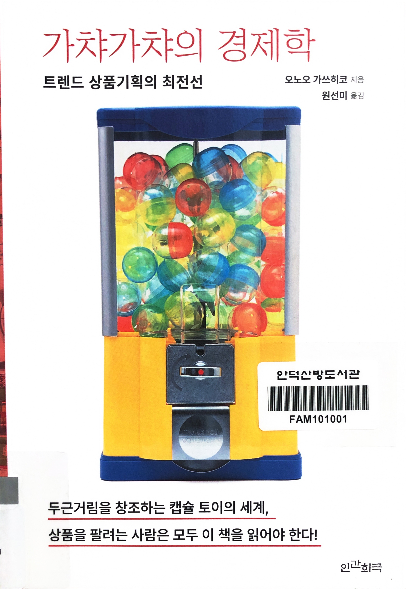

# 가챠가챠의 경제학

Tags: product
Date: March 29, 2025
Score: ★★★☆☆

- ★★★☆☆ March 29, 2025
    - '가챠가챠의 경제학'은 캡슐 토이 산업의 다양한 측면을 심층적으로 탐구한 비즈니스 서적이다. 이 책은 업계의 변화, 비즈니스 구조, 그리고 업체 사장이나 크리에이터와의 인터뷰를 통해 우리가 미처 알지 못했던 캡슐 토이 세계를 상세히 조명한다.
    - 특히 매달 새로운 상품을 기획하고 출시해야 하는 업계의 역동성, 환경을 고려한 캡슐 성분의 변경이나 캡슐이 필요 없는 상품의 제작, 그리고 디지털 상품에 대한 고민 등 캡슐 토이를 진지한 비즈니스로 바라보는 다양한 시각을 제공한다. 책을 읽으면서 캡슐 토이 산업이 단순한 장난감 판매를 넘어서는 복합적인 산업임을 알 수 있었다.
    - [회당 7000원씩 받아도 불티…문방구 '캡슐 뽑기'의 화려한 부활](https://n.news.naver.com/mnews/article/277/0005543526?sid=103)
