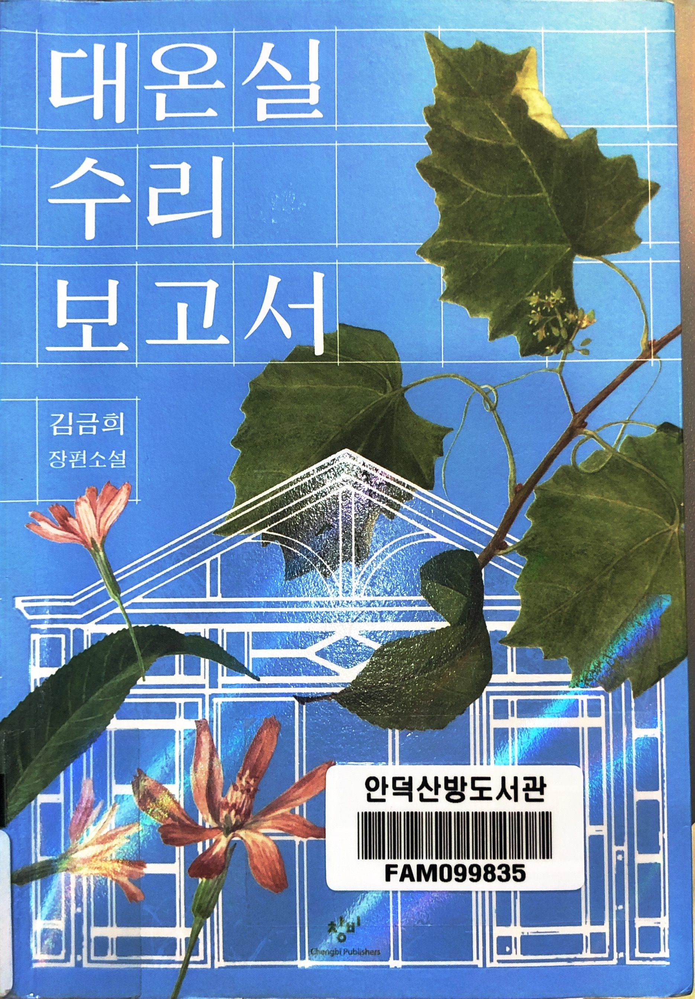

# 대온실 수리 보고서

Tags: novel
Date: Apr 14~16, 2025
Score: ★★★☆☆

- ★★★☆☆ Apr 14~16, 2025
    - 오랜만에 장편 소설을 읽었다. 도서관에서 오랫동안 예약을 걸어두고 기다린 끝에 드디어 빌려 읽을 수 있었다. 이전에 비슷한 경험을 한 책은 "나는 메트로폴리탄 미술관의 경비원입니다"였다. 하지만 이번 책은 기대했던 만큼의 감흥을 주지 못했다. 어렸을 때는 소설을 주로 읽었지만, 나이가 들면서 소설을 거의 읽지 않게 되어, 아마도 그 영향도 있었던 것 같다.
    - 이 책은 과거와 현재를 오가며 이야기가 전개된다. 이러한 서사 구조는 내겐 "베니스의 개성상인"을 떠올리게 한다. 이 책도 과거와 현재를 오가는 서사가 특징 중 하나로, 어렸을 때 현대의 이야기보다 과거의 이야기를 정말 재미있게 읽었고, 아직도 보관하는 책이다. 또한, 창경궁의 아픈 역사를 배경으로 현실과 가상을 혼합한 방식은 "다빈치 코드"와 유사하다고 느꼈다. 개인적으로 워낙 좋아하는 역사를 소재로 한 소설이지만, 전반적인 만족도는 높지 않았다.
    - 시간을 넘나드는 서사에도 불구하고, 공간적으로는 석모도와 창경궁, 그리고 그 주변에 국한되어 있어, 이야기의 스케일이 다소 제한적으로 느껴졌다. 이로 인해 스펙타클한 요소가 부족했던 것 같다. 그렇다고 해서 책이 재미없는 것은 아니지만, 기대가 너무 컸던 탓에 읽고 난 후의 만족감은 크지 않았다.
    - 책과 별개로, 팟캐스트 "책걸상"에서 주인공의 어린 시절 겪은 어려움이 인생 전체에 큰 영향을 미칠 수 있는지에 대한 의문을 이야기했다. 나는 그러한 경험이 충분히 인생에 큰 영향을 미칠 수 있다고 생각한다. 이 책에서도 영두의 과거 트라우마가 현재의 행동과 선택에 큰 영향을 미치는 모습이 잘 드러났다고 느꼈다. 소설을 읽으면서 “책걸상” 출연자들은 어렸을 때 학교 생활에 어려운 일이 없었나? 하는 생각이 들었다.
