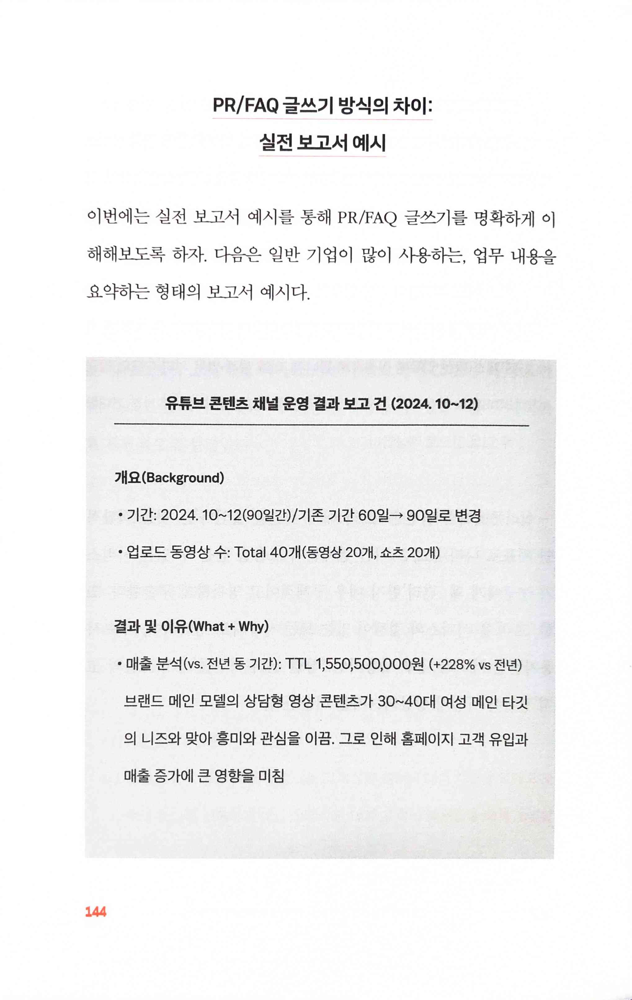
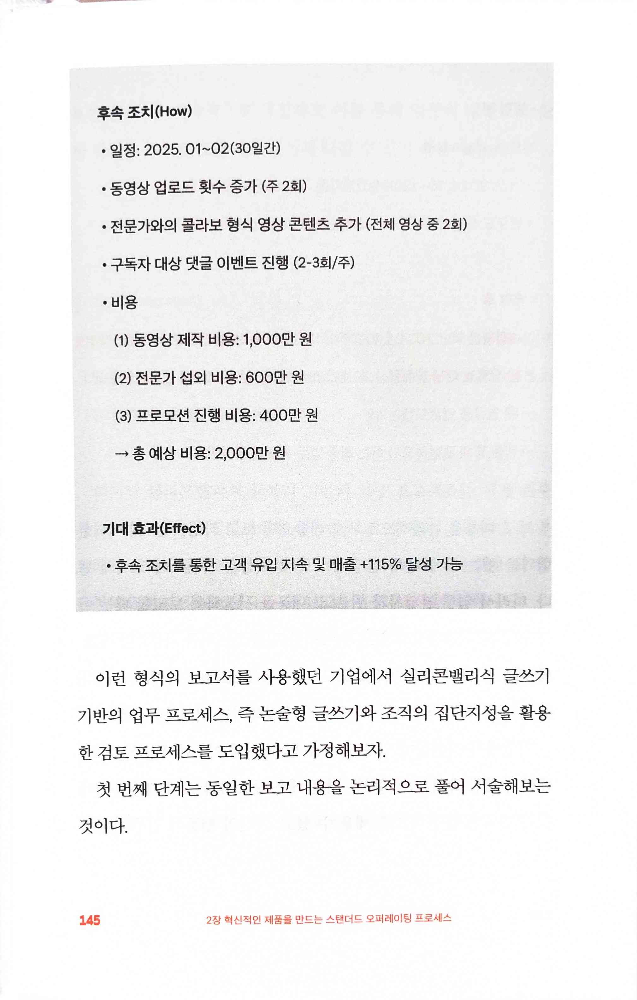
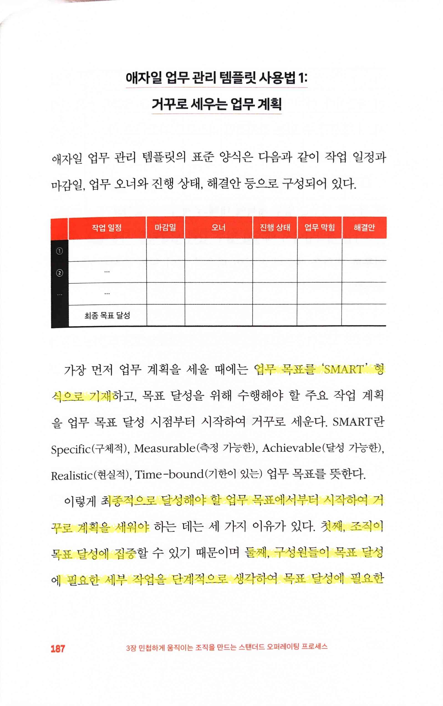
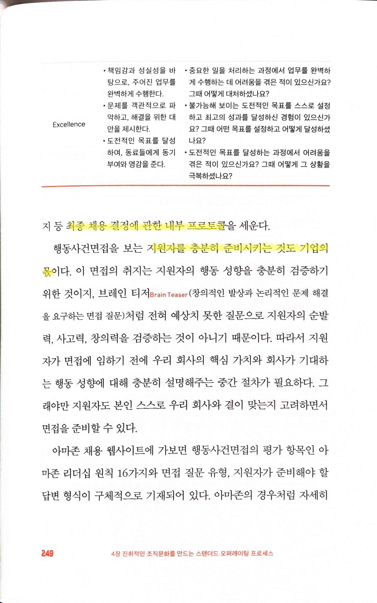

# 실리콘밸리 프로세스의 힘 The Power of Process

Tags: management
Date: April 21, 2025 → April 22, 2025
Score: ★★★★☆

- ★★★★☆ April 21, 2025 → April 22, 2025
    - 경력 방향을 매니지먼트로 전환한 후, 관련 도서를 많이 읽었다. 그중에서도 아마존과 제프 베이조스에 관한 여러 책들을 인상깊게 읽고 참고했다. 저자는 아마존에서 일한 경험도 있고, 회사 자체가 워낙 강력한 프로세스로 잘 알려진 회사라 아마존의 사례를 많이 든다.
    - 책의 가장 큰 특징은 모든 업무를 **프로세스 관점**에서 해석한 점이다. **Working Backwards나 PR/FAQ** 개념을 알고 있었지만, 이 책은 모든 업무를 체계적으로 프로세스화한 접근 방식에서 차별성을 갖는다. 단순히 개별 사례를 소개하는 데 그치지 않고, 프로세스가 조직 전체에 미치는 영향을 깊이 있게 다룬다.
    - 책의 내용을 일반적인 업무에 적용하기는 비교적 쉬울 것이라고 생각한다.대부분의 회사에서 진행되는 주간 회의에 저자가 제안한 방식을 도입하면 큰 변화를 일으킬 수 있다. 예를 들어, 단순 보고 중심의 회의를 데이터와 분석 기반의 의사결정 중심으로 바꾸는 방식은 management를 맡은 후 시도했던 변화의 경험을 바탕으로 생각해보면 실질적인 효율성 향상을 가져올 수 있다. 다만 모든 변화가 그렇듯, 내부 구성원의 협조와 지지가 필수적이다. 특히 전통적인 산업이나 과거의 한국 회사처럼 변화에 저항이 큰 조직에서는 더 많은 노력이 필요할 수 있다.
    - [실리콘밸리가 사용하는 일하는 프로세스 - YouTube](https://www.youtube.com/watch?v=F42oxFb9gfc&ab_channel=%ED%87%B4%EC%82%AC%ED%95%9C%EC%9D%B4%ED%98%95)
- pp9~11
    
    
    
    - 전략 strategy이 전쟁을 이기기 위한 계획, 전술 tactic은 그 실행 방법
    - 기업의 경영 전략이 성공을 위한 장기적이고 근본적인 계획인 ‘What’
    - 전술은 이러한 계획을 달성할 수 있는 구체적인 실행 수단이자 행동 지침인 ‘How’
    - 핵심 경영 ‘전략’의 두 축… 혁신적인 제품 출시와 조직력 강화
    - “위대한 기업은 훌륭한 제품이 만든다” 일론 머스크
    
    
    
    - 제품 기획 역량을 키우고 지속적으로 강화… 기업의 미래와 지속적인 성장을 위한 필수 전략
    - 조직을 한 방향으로 일사불란하게 움직이며 목표를 달성… 조직력 강화
        - 조직의 실행력 강화
        - 내부 결속을 다지는 강한 조직문화 구축
        - 조직이 신뢰할 수 있는 공정한 평가제도 수립
    
    
    
    - SOP, 즉 스탠더드 오퍼레이팅 프로세스… 작업을 수행하는 방법을 단계별로 정리한 지침… 업무 수행 절차를 표준화하고 규격화
        - ‘문서화된 프로세스 상세 운영 매뉴얼’
- p44
    
    
    
    - 제프 베이조스… 기업의 경영 전략은 변하지 않는 것에 토대를 두어야… ‘고객이 원하는 가치’를 제공한다면 고객은 외면하지 않는다
    - ‘고객이 무엇을 필요로 할지’
    - 고객의 어떠한 ‘문제를 해결’
- p48
    
    
    
    - 강한 조직문화의 본질… 빠르게 변화하는 상황에서의 ‘조직의 대응 능력’을 강화… 강한 실행력
- pp50~52
    
    
    
    - 제프 베이조스… “기업 운영은 ‘좋은 의도’만이 아닌 목표한 바를 달성하도록 설계된 ‘체계적인 운영 메커니즘’ 속에서만 가능하다”
    
    
    
    - 목표 달성을 위한 세부적인 프로세스를 설계하고 체계적인 매커니즘을 구축해 조직의 성과가 일회성이 안니 지속적으로 이어질 수 있도록
    - 프로세스란 어떤 목적을 달성하기 위해 취해야 할 일련의 행동과 일의 순서를 단계별로 나열
        - 달성하고자 하는 목표가 분명
        - 목표를 가장 빠르고 효율적으로 달성하도록 하는 일의 순서가 명확
        - 정해진 순서에 따라 일을 진행하면 달성하고자 하는 특정 결과를 매번 도출
        - 누가 그 일을 하느냐에 상관없이 늘 일관성 있는 결과를 빠르고 정확하게 이끌어낸다
    - 확장성이 매우 뛰어난 것도 장점
    
    
    
    - 조직의 역량을 꾸준하게 강화
    - 빈스 롬바르디 Vince Lombardi… 승리하라면 승리에 필요한 모든 일을 어쩌다 한 번 하는 팀이 아니라, 늘 꾸준하게 하는 팀이 되어야… ‘승리는 습관 winning is a habit’

- pp57~58
    
    
    

- p84
    
    
    
    - 고객 중심적인 제품 기획
        1. 고객의 문제를 명확하게 정의
            1. ‘문제’란 가장 이상적인 고객 경험과 현실과의 격차
        2. 고객의 문제를 완벽히 해결하는 것을 제품 기획의 지향점으로 설정
            1. ‘완벽한 문제 해결’이란 ‘문제 파괴’
        3. 고객의 문제가 완벽히 해결됐을 때의 가장 이상적인 고객 경험을 먼저 설계하고 이러한 경험을 제공할 수 있는 제품을 거꾸로 개발
- p86
    
    
    
    - 고객이 겪는 문제를 명확하게 문제로 인식하고 정의… 고객 중심적 제품 기획의 가장 중요한 시작점
    - 이 책의 유일한 오점으로 생각하는 부분. 아마존 고의 실체는 혁신이 아니라 사기였기 때문에 이런 사례에는 부적합하다
        - https://www.youtube.com/watch?v=aOK_CnYymeQ
- p98
    
    
    
    - 혁신적인 제품을 기획하려면 우리의 보편적인 생각의 틀을 의도적으로 깰 수 있는 파괴적 사고 기법을 활용하여 ‘완벽한 문제 해결’의 지향점을 명확하게 설정해야 한다. 문제 해결의 지향점이 곧 제품의 혁신성을 좌우하기 때문
- p111 보편적인 제품 기획 방식과 퓨처 백 future back 기획 방식의 차이
    
    
    

- pp114~115
    
    
    

- p123
    
    
    
    - 제품-시장 적합성… 앤디 라클레프 Andy Rachleff와 마크 안드레센 Marc Andressen이 대중화
    - 제품-시장 적합성… ‘절박하게 찾는 고객이 있는 제품’… 단순히 수요가 있고 없고의 개념이 아닌 ‘니즈’ 기반의 고객 중심적 제품이라는 의미
    - 기하급수적인 유기적 성장을 이룰 수 있는 유일한 방법은 입소문뿐… 입소문을 얻는 유일한 방법은 고객을 진정으로 만족시키는 것 - 앤디 라클레프
- p125
    
    
    
    - PR/FAQ… 제품과 서비스 기획을 고객의 관점에서부터 출발하는 아마존의 워킹 백워드 Working Backwards 업무 방식
- pp129~131
    
    
    
    - 외부 FAQ: 고객이 절실히 필요로 하는 제품인가?
    
    
    
    - 내부 FAQ: 사업 계획의 타당성이 있는가?
        1. ‘성공’을 어떻게 측정… 사업 목표는?
        2. 예상 손익은… 수익 구조는…
        3. 왜
        4. 필요한 자원
    
    
    
    1. 위험 요소

- pp144~145
    
    
    

- pp149~152
    
    
    
    
    

- p179
    
    
    
    - 래리 보시디 Larry Bossidy <실행에 집중하라> 조직의 실행력을 강화하고 싶다면 리더가 조직의 일에 깊숙이 관여하고 실무자의 목소리를 경청해야 한다
    - 조직의 리더가 실행을 챙기지 않으면 그 기업의 실행력과 속도는 뒤처지기 마련
- pp186~189, p192
    
    
    
    1. 목표 달성을 위한 구체적인 행동을 작은 작업 단위로 세분화… 실행의 순서를 계획
    2. 협업이 필요한 모든 업무를 계획에 반영… 업무 오너를 지정
    3. 주기적으로 조직의 행동 실행을 관리
    
    
    
    
    
    - 업무 목표를 ‘SMART’ 형식으로 기재
    - 최종적으로 달성해야 할 업무 목표에서부터 시작하여 거꾸로 계획을 세워야…
        - 첫째, 조직이 목표 달성에 집중
        - 둘째, 구성원들이 목표 달성에 필요한 세부 작업을 단계적으로 생각하여 목표 달성에 필요한 시간과 리소스를… 현실적으로 추정
        - 셋째는 거꾸로 업무 계획을 세워야 계획 실행시 발생할 수 있는 잠재적인 리스크를 파악하고 미연에 방지
    
    
    
    
    
- p239
    
    
    
    - 행동사건면접 BEI Behavioral Event Interview … 충분한 시간을 두고 능동적인 성향의 지원자를 선별
    - 줄리 주오 Julie Zhuo <팀장의 탄생> … 미리 어떤 역할을 채용할지 계획하는 것은 당신이 꿈꾸는 팀을 만드는 데 도움
- pp246~249
    
    
    
    - 회사가 원하는 조직문화에 가장 적합한 인재상을 정의
    
    
    
    - ‘어떤 상황에서 어떤 행동을 보이는 사람’이라고 구체적으로 여러 가지 상황을 상정… 객관적인 채용 평가 기준
    - 다양한 질문 사례들을 만들어 채용 매뉴얼을 작성
    - 디브리핑
    
    
    
    
    
    - 최종 채용 결정에 관한 내부 프로토콜
    - 지원자를 충분히 준비시키는 것도 기업의 몫
- pp252~253
    
    
    
    - 모든 인간의 행동을 이끄는 핵심 동기 요인인 RICE 모델
        - R - 보상 Reward
        - I - 이데올로기 Ideology
        - C - 강요 Coercion
        - E - 자존심 Ego
    
    
    
    - 가장 강력한 것은 인간 자신을 넘어서는 위대한 대의에 관한 신념, 즉 이데올로기
    - 조직 문화를 구축하는데 매우 핵심적인 요소로 활용
    - ‘고객 중심’
- p258
    
    
    
    - 제프 베이조스
        - “(경영은) 좋은 의도만 가지고는 안 됩니다. 메커니즘이 필요하죠 Good intentions don’t work. Mechanisms do.”
        - 회사의 핵심 운영 프로세스를 ‘고객 제일주의’ 기반으로 재설계
- p281
    
    
    
    - 다니엘 핑크 Daniel Pink <드라이브> 내적 동기 부여에 필수적인 세 가지 요건… 자율성 autonomy, 목적의식 purpose, 숙련 mastery
- p288
    
    
    
    - 결과는 보지 않고 프로세스를 따르는 그 행위에만 집중할 때 프로세스가 의도한 본래의 의미가 상실
    - ‘악마는 디테일에 있다 The devil is in the details’
        - 대충 보면 무척 쉬워 보이는 어떤 일도 이를 제대로 해내려면 예상보다 더 많은 시간과 노력을 쏟아부어야
