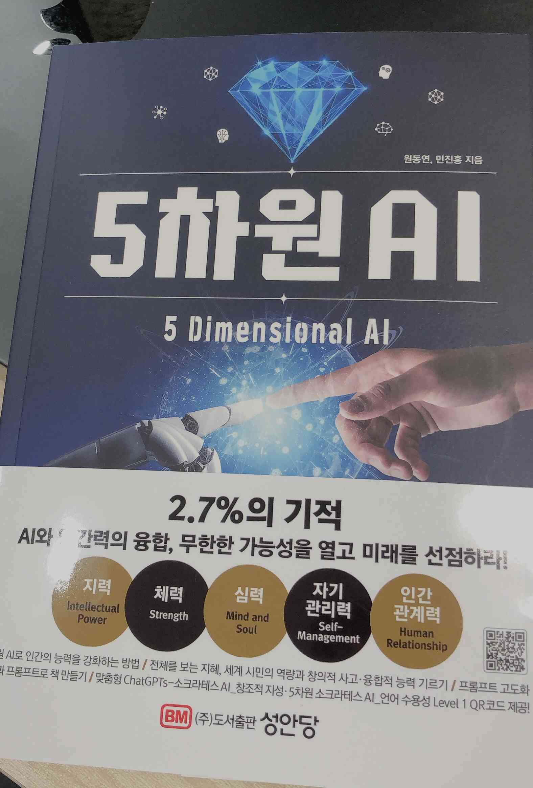

# 5차원 AI

5차원 AI는 교육 전문가와 프롬프트 엔지니어링 전문가가 공동으로 집필한 책으로, AI 시대에 교육을 혁신하는 방법을 다룬다. 책은 두 부분으로 구성되어 있으며, 각 저자가 자신의 전문성을 살려 AI와 교육의 융합을 다룬다. 교육 전문가 원동연님은 AI 시대에 필요한 교육 철학을, 프롬프트 엔지니어링 전문가 민진홍님은 이를 실현하기 위한 AI 활용법을 제시한다.
            
1부는 AI 시대에 맞춘 교육의 미래를 그린다. 저자는 전통적인 교육 방식의 한계를 넘어 개인 맞춤형 학습을 강조하며, AI가 학생 개개인의 필요에 맞춰 학습 경험을 제공할 수 있다고 설명한다. 이는 교육의 적응성과 효율성을 높이는 데 핵심적인 역할을 한다.
            
2부는 AI를 교육에 적용하는 구체적인 방법을 소개한다. 이제는 대부분의 사람들이 알지만, 프롬프트 엔지니어링은 AI 시스템에 적절한 입력을 설계해 원하는 출력을 얻는 기술로 정리할 수 있는데, 교육 도구로서 AI의 잠재력을 극대화하는 데 초점을 맞춘다. 예를 들어, 학생의 질문에 정확히 응답하거나 학습 과정을 지원하는 AI 도구를 만드는 방법을 다룬다.
            
이 책은 AI를 활용해 교육을 혁신하려는 의도가 분명히 드러난다. 특히 프롬프트 엔지니어링을 교육에 접목하려는 시도가 인상 깊다. 다만, 1부의 교육 철학과 2부의 기술적 접근 사이에 논리적 연결이 조금 약하게 느껴졌다. AI를 교육에 통합하는 과정에서 발생하는 윤리적 문제와 디지털 격차 같은 현실적인 이슈를 다루는데, 프롬프트 엔지니어링이 이를 해결하는 데 기여할 수 있다고 제안한다. 예를 들어, AI를 책임감 있게 설계함으로써 교육의 포용성과 공정성을 높일 수 있다는 점을 강조하는데, 두 부분이 더 매끄럽게 이어졌다면 책의 설득력이 더 강했을 것 같다. 그럼에도 불구하고, 각 저자가 자신의 전문성을 살려 제시한 아이디어는 이해하기 쉽고, 교육과 AI의 미래를 고민하는 데 도움이 된다. AI 시대의 학습과 교육에 관심 있는 독자라면 한 번쯤 읽어볼 만한 책이다.
