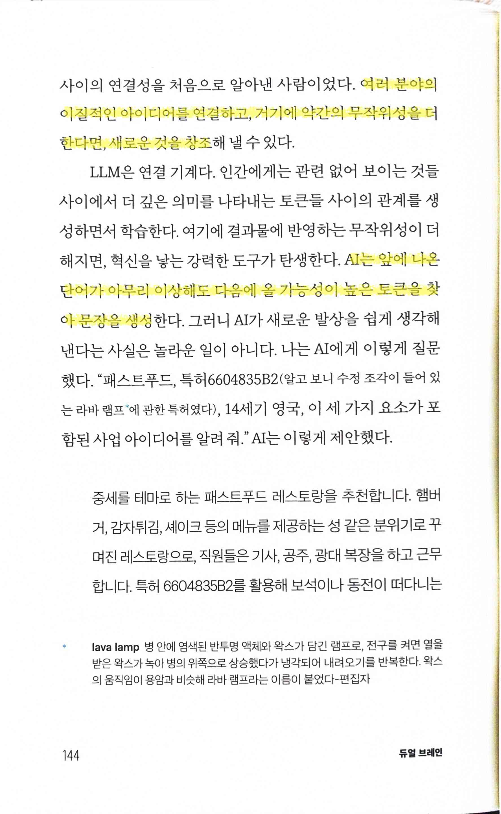
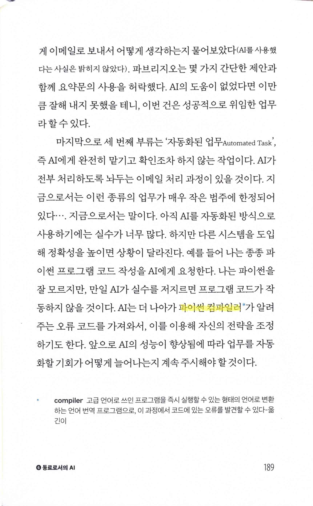

# 듀얼 브레인 Dual BrAIn

Tags: artificial-intelligence
Date: April 28, 2025
Score: ★★★☆☆

- ★★★☆☆ April 28, 2025
    - 제목에서 잘 드러나지만 결론부터 말하면 AI를 “제2의 두뇌”로 적극 수용하자는 메시지를 담았다.
    - 와튼 스쿨 교수인 저자는 AI를 전공하거나 연구하지는 않았으나, 실제 생활이나 작업에 어떤 영향을 줄지 초반부터 고민했다. 자신의 수업에도 적극 수용해, 학생들의 AI 사용을 무제한으로 허용하되, 결과 역시 책임지도록 한다. 새로운 도구 사용을 막을 수 없고, 사회에 나가서 겪을 문제를 미리 학교에서 경험하도록 했다는 점을 생각해보면, 미리 시대의 흐름을 파악하고 빠르게 적용하는 선견지명을 보여준, 매우 뛰어난 대처였다(책 표지에 나왔듯 24년에 상을 받았다는 점을 보면 23년에 이미 이런 식의 수업을 했다는 의미이다. 25년 현재와 비교할 때 2년 전의 AI 성능을 생각해보면 이런 신속하고 과감한 결정은 아무나 할 수 있는 일은 아니다).
    - 1부는 AI의 기본 개념을 비기술자도 이해할 수 있도록 간단히 설명한다. 2부에서는 역할별 조언으로 다양한 직업과 역할에서 AI와 공존하는 방법을 제안하고, AI를 단순 도구 이상으로, 함께 성장할 동반자로 다룬다.
    - 마침 이 책을 읽으면서 뉴스를 보니 메타버스한다고 이름을 바꿨던 Meta는 AI에 주력하더니 이제 AI 앱을 별도로 출시했고, 듀오링고의 CEO는 전사 전면 도입을 공식적으로 선언했다. 이렇게 조만간(혹은 지금 즉시!) AI 도입이 불가피한 지금, 이 책은 AI를 이해하고 효과적으로 활용하고자 하는 이들에게 귀중한 길잡이가 될 수 있다. 읽어보면 조금이라도 이해도를 높이고 충격을 줄여, AI를 단순한 도구가 아닌 강력한 동반자로 받아들이는 데 한 걸음 다가설 수 있다.
        - https://about.fb.com/news/2025/04/introducing-meta-ai-app-new-way-access-ai-assistant/
        - https://www.theverge.com/news/657594/duolingo-ai-first-replace-contract-workers

- p90
    
    
    
    - 패턴을 깨면 훨씬 더 유용하고 흥미로운 답변… 패턴을 깨는 가장 쉬운 방법은 맥락과 제약을 정해 주는 것
    - 페르소나 persona
- p92 prompting 기초
    
    
    
    - AI에게 특정한 페르소나를 맡아서 답변해 달라고 요청하면, 그러지 않았을 때보다 훨씬 나은 답변
- pp142~144 창의성의 핵심 재조합
    
    
    
    - 환각은 AI가 학습 데이터의 엄격한 맥락을 벗어나 완전히 새로운 연결을 찾을 수 있게 한다
    - AI 창의성의 역설… LLM을 사실이 중요한 작업에서 신뢰할 수 없고 위험하게 만드는 바로 그 특성이 LLM에게 창의성을 부여
    
    
    
    - 색다름과 독창성
    - 새로운 아이디어는 하늘에서 뚝 떨어지는 것이 아니라 기존의 개념에 기초… 재조합의 중요성
    - 획기적인 발견은 거리가 멀고 관련이 없어 보이는 개념을 연결할 때 나오는 경우가 많다
    
    
    
    - 여러 분야의 이질적인 아이디어를 연결하고, 거기에 약간의 무작위성을 더한다면, 새로운 것을 창조
    - AI는 앞에 나온 단어가 아무리 이상해도 다음에 올 가능성이 높은 토큰을 찾아 문장을 생성
- pp168~169
    
    
    
    
    
    - AI에게 거의 모든 종류의 초안을 맡긴다
    - 창의성과 독창성을 잃게 된다
    - 사고와 추론의 질과 깊이가 떨어지는
- p189
    
    
    
    - 개발에 대한 지식이 없어서 이 부분은 제대로 검토하지 못한 듯. 바이트 코드 변환과정만 놓고 보면 컴파일러란 표현을 써도 무방할 수 있지만, 특히 각주 내용까지 감안하면 잘못 이해했다는 점을 확실히 알 수 있다. 물론 대상 독자가 개발자가 아니니 무관하다고 볼 수 있지만.
- pp206~207
    
    
    
    - 조직에서 업무를 구조화하고 조율하는 데 사용하는 시스템
    - 역사적 유물이며, 그 시대의 기술과 사회적 조건에 의해 형성
    - 조직도
    - 조립 라인
    
    
    
    - 인터넷은 업무를 조직하고 통제하는 또 다른 새로운 기술
    - 데이터 기반의 새로운 관리 방식
    - 여전히 인간의 능력과 한계가 업무 수행의 기준
- p220
    
    
    
    - 2 시그마 문제 The 2 Sigma Problem
        - 일대일 수업을 받은 학생들의 평균 성적이 상위 2퍼센트
        - 교사와 학생의 상호작용에 쉽게 모방할 수 없는 독특하고 강력한 무언가가 있다는 점을 암시
- p225
    
    
    
    - 계산기가 처음 학교에 도입됐을 때의 반응은 오늘날 글쓰기 과제에 AI를 활용하는 것에 대한 우리의 우려와 놀랍도록 비슷
- pp228~229
    
    
    
    
    
    - AI를 무제한으로 사용… AI가 생성한 모든 결과를 학생이 책임
    - 어떤 계획이든 피드백이 도움
- pp254~255
    
    
    
    - 최고 수준의 운동선수와 평범한 운동선수의 차이를 만드는 데 의식적인 연습이 기여하는 정도는 겨우 1퍼센트에 불과… 나머지는 유전, 심리, 양육 환경, 운이 복합적으로 작용
    - ‘10배 엔지니어’
    
    
    
    - 가장 뛰어난 사람에게도 취약한 부분이 있기 때문에, 잘하는 분야에 집중하려면 더 큰 조직의 일부가 되어야
    - AI의 주요 효과 중 하나는 경쟁의 장을 평준화
