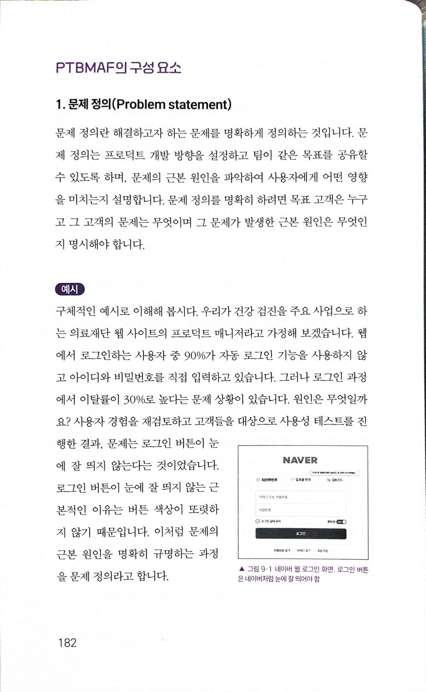
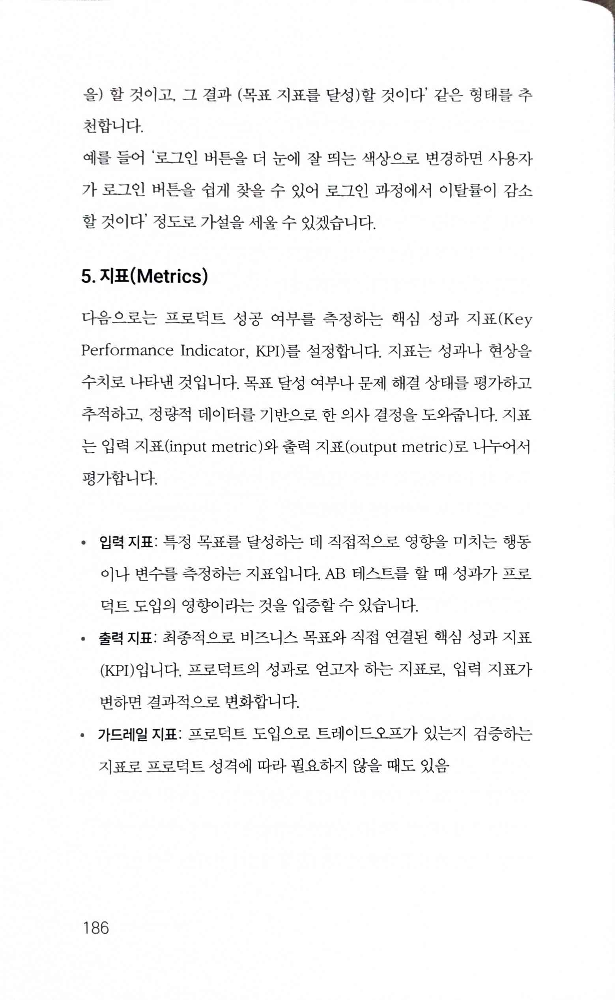
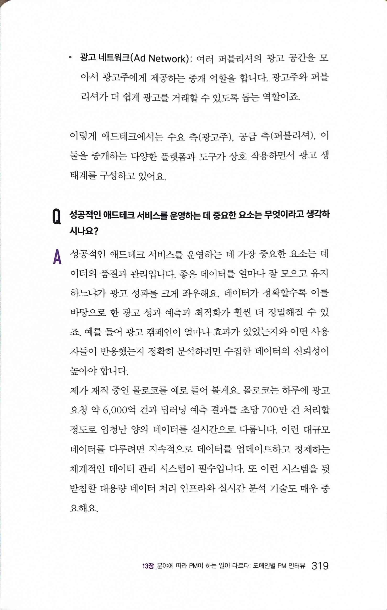

# 제품을 성공시키는 프로덕트 매니저의 비밀 The Secret of product managers who make products succeed

Tags: product
Date: April 29, 2025 → April 30, 2025
Score: ★★★☆☆

- ★★★☆☆ April 29, 2025 → April 30, 2025
    - 최근 Product Manager, Product Management 관련 서적이 많이 출간되면서 이제는 “PO가 무슨 일을 하냐”고 묻는 사람이 줄었지만, 여전히 이 직무에 대한 명확한 소개와 실제적인 안내가 필요한 시점임을 느꼈다.
    - 이 책은 쿠팡, SSG닷컴 등에서 PM 경험을 쌓은 저자가 단순 이론이 아니라 실제 업무에서 겪었던 사례와 구체적인 예시를 풍부하게 담은 것이 큰 강점이다. 특히 JTBD나 PRD 등 핵심 개념을 실제와 유사한 상황에 적용해 보여주기 때문에, 현업에 바로 적용할 수 있는 실질적인 도움을 준다.
    - 다른 PM 서적과 차별화되는 점은, 현장감 있는 실무 경험과 구체적인 예시를 통해 이론과 실무의 간극을 좁혀준다는 점이다. PM 직무에 관심 있는 초보자뿐 아니라, 실무에서 바로 적용할 수 있는 팁과 사례를 찾는 이들에게 추천할 만하다.
    - 마지막에는 PM과 협업하는 다양한 직군 실무자, 그리고 PM으로 일하는 사람들과의 인터뷰를 통해 PM 외부와 내부의 시각을 모두 보여줘, 이론과 실제가 적절히 섞인 좋은 책이라고 생각한다.
    - PM 직무에 관심 있는 초보자뿐 아니라, 실무에서 바로 적용할 수 있는 팁과 사례를 찾는 이들에게도 강력히 추천할 만하다.

# 8장 아이디어 도출

## 비즈니스 모델 캔버스 Business Model Canvas

- pp150~154 비즈니스 모델 캔버스
    
    
    
    
    
    
    
    
    
    
    

## 해결해야 할 문제(JTBD) 탐색

- p158 쿠팡 TV 구매: 기존 TV 교체 고객 JTBD 탐색 Jobs to be Done
    
    
    

# # 9장 기획안 작성

## 프로젝트 제안 프레임워크(PTBMAF) 소개

- pp181~192 경인태님을 통해 익숙해진 PTBSMAF인데, 이 책에서는 왜인지 PTBMAF로 표기했다. 회사가 잘 나가니 이렇게 직무를 설명하는 책에서도 자신있게 소개한다는 생각이 들었다(물론 유용하기 때문이지만).
- p181
    
    
    

### Problem statement

- p182 Problem statement
    
    
    

### Tradeoff

- p183 Tradeoff
    
    
    

### Benchmark

- p184 Benchmark
    
    
    

### Hypothesis

- p185 Hypothesis - 나는 solution으로 작성하는 게 더 익숙하지만 생각해보면 hypothesis가 더 적절할 거 같단 생각도 든다
    
    
    

### Metrics

- p186 Metrics
    
    
    

### Andon & Feedback loop

- p187 Andon & Feedback loop
    
    
    

## PRD: 가전 ‘신제품 배지 기능

- p189 PRD
    
    
    
    - PM 인터뷰를 볼 때 주제를 주고 문서를 작성하게 하는데 그럴 때 참고하면 좋겠단 생각이 든다.

# 10장 화면기획서

- 10장 화면기획서를 읽으면서 문득 든 생각
    - 기획/prd는 화면부터 하는데 왜 개발은 db부터 프론트로? 내가 생각하는 working backwards가 더 나을 듯

# 12장 PM과 함께 일하는 사람들: 협업자 인터뷰

- pp268~269
    
    
    
    
    
- pp276~277
    
    
    
    
    
- p284
    
    
    

# 13장 분야에 따라 PM이 하는 일이 다르다: 도메인별 PM 인터뷰

- pp316~322
    
    
    
    
    
    
    
    
    
    
    
    
    
    
