# 인생의 의미 Seven Meanings in Life

Tags: essay
Date: January 20, 2025
Score: ★★★☆☆

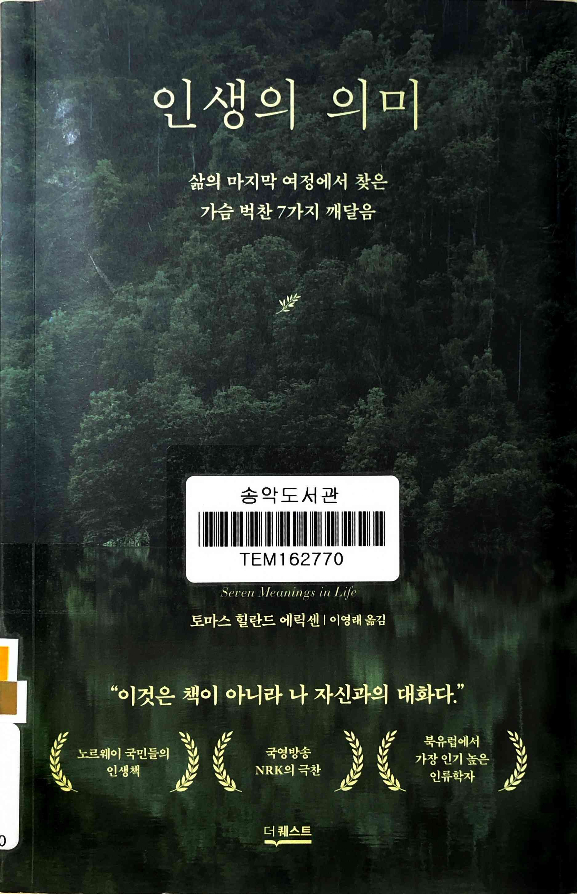

- ★★★☆☆ January 20, 2025
        
    한동안 마음이 불안정했던 시기에 우연히 발견한 책이다. 유사한 죽음을 대하는 사람들의 책을 반복적으로 읽으며 마음을 달래던 중 읽었는데, 잠시나마 어지러운 마음이 환기가 되었다. 나이가 들며 삶에 대한 시각이 변했는지, 과거에는 공감하기 어려웠던 이야기들이 마음에 와닿았다.
    이 책은 ‘집착’과 ‘번뇌’라는 인간의 보편적 고민을 다루는데, 벗어나려 애쓰기보다 심리적 수용의 중요함을 강조한다. 불완전함을 인정하는 과정 자체를 통해 위로를 얻을 수 있다고 알려준다. 물론 이런 서적이 그렇듯 뜬구름 잡는 이야기를 한다고 생각할 수 있으므로 실제로 나아질 게 없다고 생각할 수도 있다. 나도 읽는 동안은 잠시 걱정을 덜 수 있었지만 실제 생활로 돌아와서는 (나의 부족함 때문이겠지만) 크게 변화한 건 없다고 생각한다.
    그럼에도 불구하고, 여러 고민으로 지친 사람들에게 잠시나마 쉬어갈 시간을 제공한다는 점에서 읽을 가치가 있다.
        
    - [https://www.youtube.com/watch?v=hxEWvv0zRlI](https://www.youtube.com/watch?v=hxEWvv0zRlI)

- p13
    
    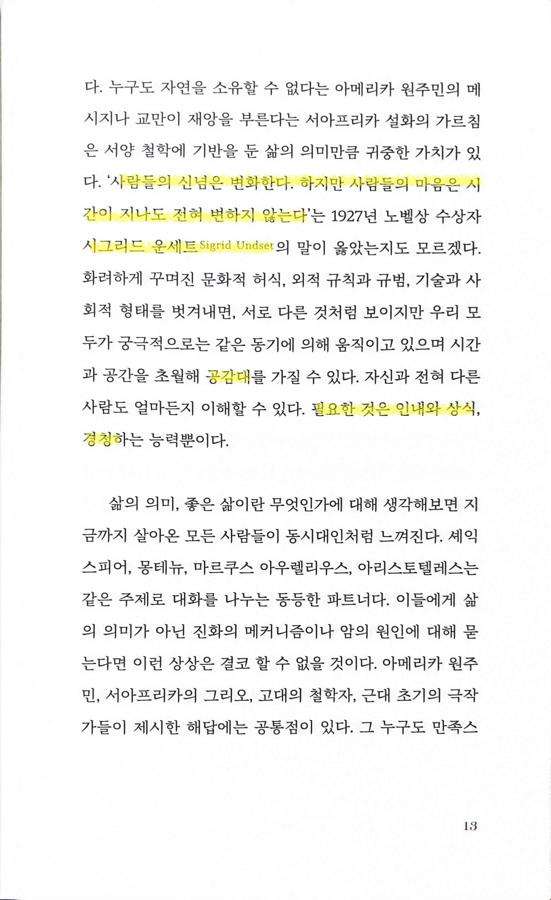
    
    - ‘사람들의 신념은 변화한다. 하지만 사람들의 마음은 시간이 지나도 전혀 변하지 않는다’ 시그리드 운세트 Sigrid Undset
        - 공감대… 필요한 것은 인내와 상식, 경청
- p38
    
    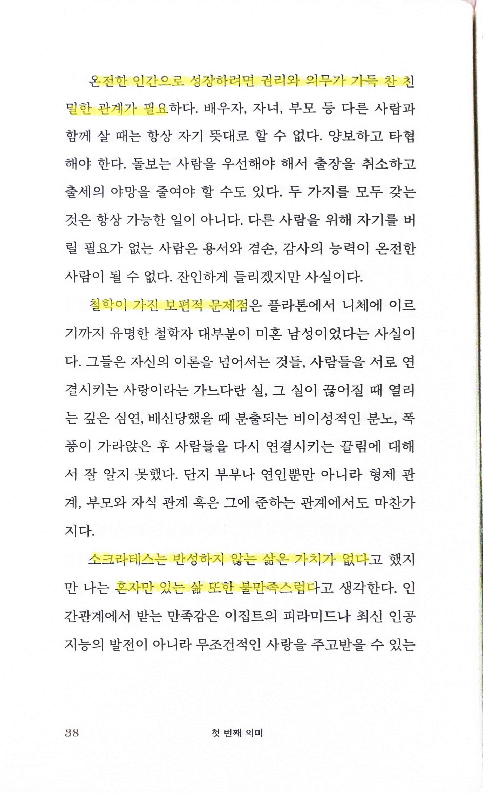
    
    - 온전한 인간으로 성장하려면 권리와 의무가 가득 찬 친밀한 관계가 필요
    - 철학이 가진 보편적 문제점
        - 주요한 학문 분야나 최근 AI 분야에서도 갖는 동일한 문제. 수천년 전부터 내려오는 문제였었나
    - 소크라테스는 반성하지 않는 삶은 가치가 없다… 나는 혼자만 있는 삶 또한 불만족스럽다
- p47
    
    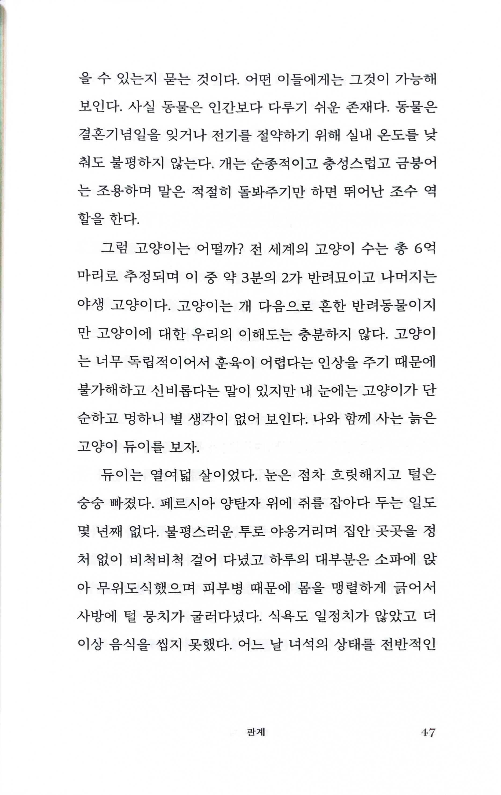
    
    - 집에서 고양이를 키우기 때문에 나도 저자의 시각에 동의한다. 귀엽지만 똑똑하단 생각은 전혀 들지 않는다 😂
- p131
    
    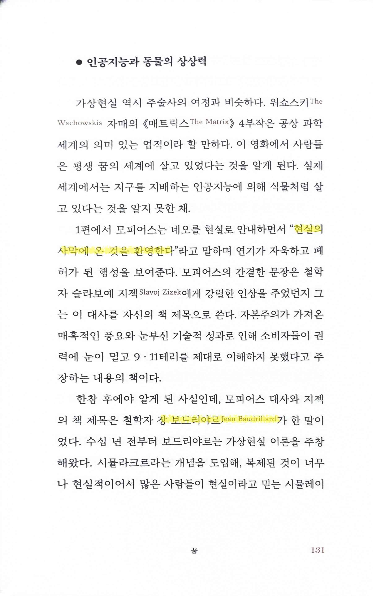
    
    - “현실의 사막에 온 것을 환영한다”… 장 보드리야르 Jean Baudrillard
- p160
    
    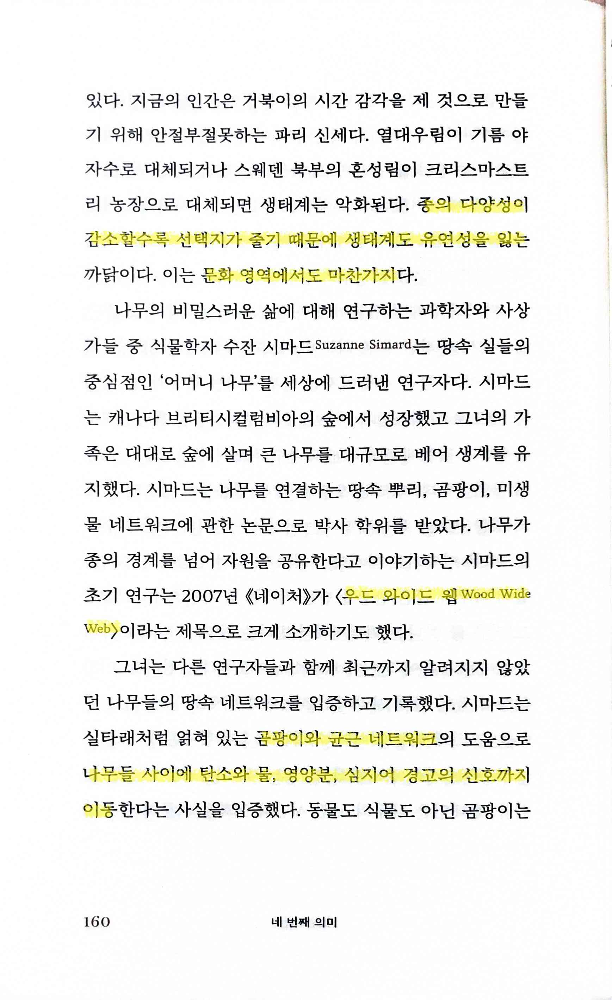
    
    - 종의 다양성이 감소할수록 선택지가 줄기 때문에 생태계는 유연성을 잃는… 문화 영역에서도 마찬가지
        - 업무에서도 마찬가지이다. 유사한 한 가지 시각만 가진 구성원들만 있으면 거기에 매몰되기 쉽다
    - <우드 와이드 웹 Wood Wide Web>
        - 곰팡이와 균근 네트워크… 나무들 사이에 탄소와 물, 영양분, 심지어 경고의 신호까지 이동
- pp178~179
    
    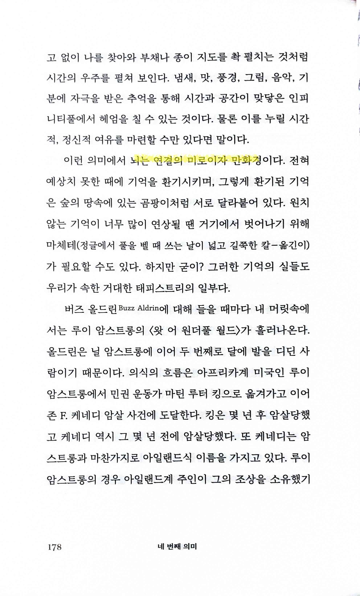
    
    - 뇌는 연결의 미로이자 만화경
    
    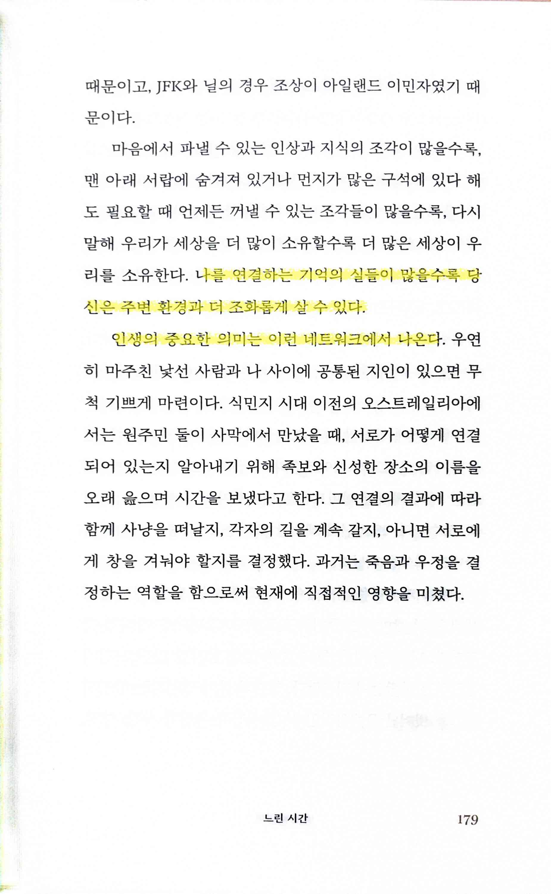
    
    - 나를 연결하는 기억의 실들이 많을수록 당신은 주변 환경과 더 조화롭게 살 수 있다
    - 인생의 중요한 의미는 이런 네트워크에서 나온다
- p201
    
    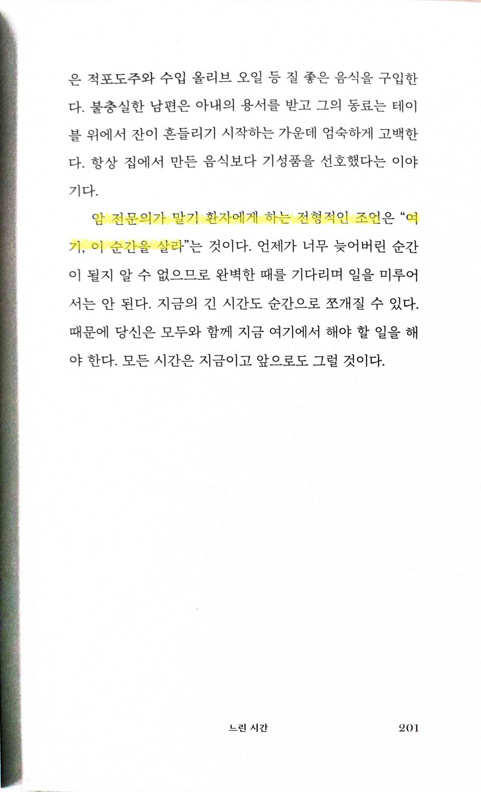
    
    - 암 전문의가 말기 환자에게 하는 전형적인 조언… “여기, 이 순간을 살라”
- p208
    
    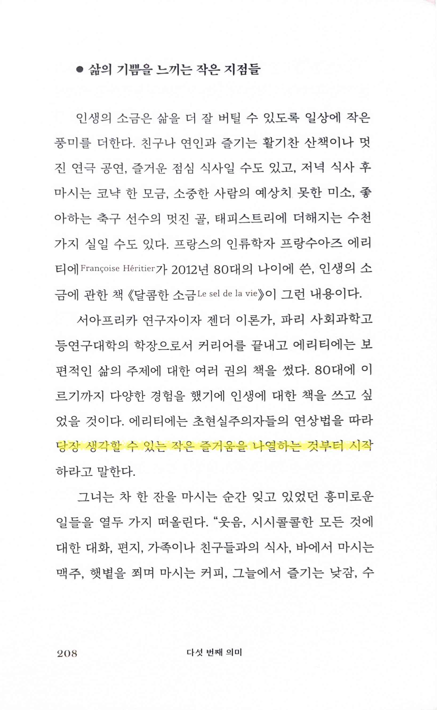
    
    - 당장 생각할 수 있는 작은 즐거움을 나열하는 것부터 시작
- pp230~231
    
    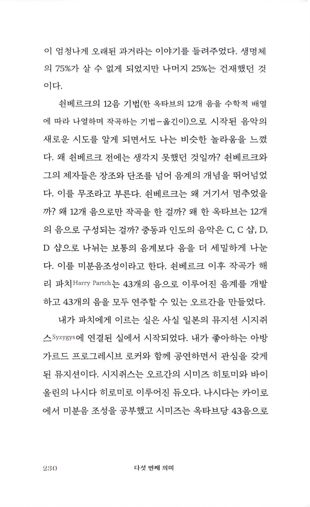
    
    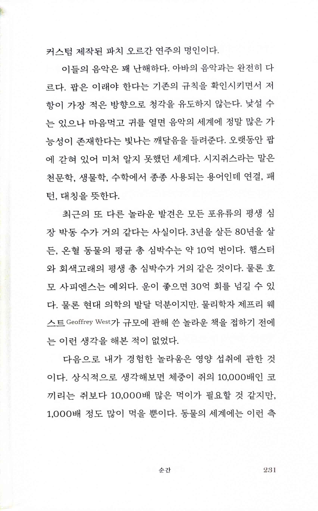
    
- p295
    
    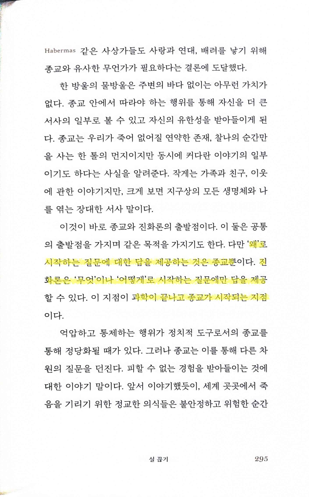
    
- ‘왜’로 시작하는 질문에 대한 답을 제공하는 것은 종교뿐… 진화론은 ‘무엇’이나 ‘어떻게’로 시작하는 질문에만 답을 제공… 과학이 끝나고 종교가 시작되는 지점
    - 종교를 가졌다가 버린 사람의 입장에서 볼 때 과학이 ‘왜’를 답하지는 못한다는 건 동의하지만, 그렇다고 종교가 ‘왜’를 답해준다는 생각이 들진 않는다
