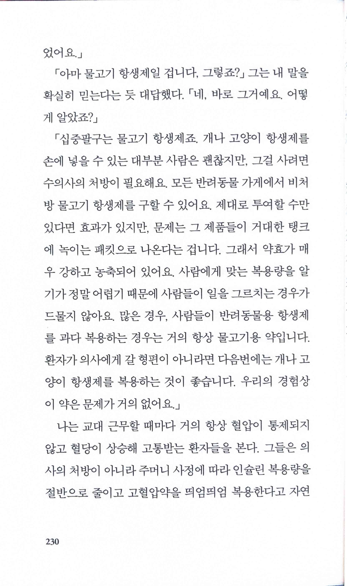

# 나는 어떤 죽음에도 익숙해지지 않는다 Code Gray

Date: May 3, 2025
Score: ★★★☆☆

- ★★★☆☆ May 3, 2025
    - 작년 말부터 올해 초까지 ‘죽음’을 화두로 삼은 여러 책을 읽었는데, 우연히 이 책을 발견하고 읽게 되었다. 이 책은 가족의 사별로 인한 상실감을 전면에 내세우기는 책은 아니고, ‘인생의 의미’와 유사하게 삶의 태도를 탐색하는 데 초점을 맞춘다. 저자는 응급의학과 의사라는 직업상 하루에도 수차례 죽음을 마주해, 현장에서 겪은 다채로운 사례를 통해 우리가 어떤 마음으로 오늘을 살아가야 할지 풀어낸다.‍
    - 저자가 강조하듯 응급실은 결코 독특한 문제가 발생하는 장소가 아니다. 오히려 일반적인 문제들이 독특하게 드러나는데, 이를 받아들이는 태도는 각자의 정신적 모델에 따라 다양하다. 그래서 정답은 존재하지 않는다. ‘아는 것이 힘이다’와 ‘무지는 축복이다’ 사이의 희미한 경계 위에서 인생은 해결되지 않는 딜레마와 답 없는 질문들로 가득 차 있다. 그럴 때일수록 저자는 불편한 경험과 불확실성을 있는 그대로 받아들이고(즐기라고 권한다), 삶의 속도를 잠시 늦춰 일상을 면밀히 들여다보라고 권한다.‍ 이러한 권고는 우리가 삶을 단단히 지탱할 수 있게 해 주는 한 가지 좋은 자세를 알려준다.
    - [인생의 의미 Seven Meanings in Life](https://www.notion.so/Seven-Meanings-in-Life-1813f0c2cf65801a9734c02c7ac934cb?pvs=21)
    - [내가 알던 그 사람 Somebody I used to know](https://www.notion.so/Somebody-I-used-to-know-1583f0c2cf6580148ae0eacd8471685d?pvs=21)
    - [내가 알던 사람](https://www.notion.so/14e3f0c2cf658056acefffc86cd03cc8?pvs=21)
    - [숨결이 바람 될 때 When Breath Becomes Air](https://www.notion.so/When-Breath-Becomes-Air-1473f0c2cf658012a3f5ed542b24ee28?pvs=21)
    - [아버지의 죽음 앞에서 Dear Life](https://www.notion.so/Dear-Life-1413f0c2cf658032b1d2de515de6d95d?pvs=21)
- pp23~24
    
    
    
    
    
    - 스웨터가 느슨해지고 축 늘어져서야 스웨터의 실이 보이는 것처럼, 나는 그들의 부재를 느끼고 나서야 그런 일상적인 관계가 큰 영향을 미쳤음을 진정으로 인식하기 시작했다
- p39 펜타닐?
    
    
    
    - 여기서 말하는 ‘펜타닐’은 마약으로 유명한 ‘펜타닐’과 동일하다
- p45
    
    
    
    - 그가 우리 시스템에 익숙하지 않아 과하게 가혹한 관점을 지녔던 게 아니라 내가 이 시스템에 익숙한 탓에 지나치게 관대한 관점을 지녔을 수 있었다
        - 종종 내부의 전문가가 개혁하기 어려운 이유. 특히 (비효율적일 수도 있지만) 절차에 맞게 잘 돌아가는 시스템에 익숙한 경우 스스로 비효율적인 면을 찾아 제거하기는 쉬운 일이 아니다
- pp51~52
    
    
    
    
    
    - 희망의 말을 건넬 때는 신중하고 적절히 조율해야 한다는 것을 어렵게 배웠다. 물론 희망을 적게 주면 타인의 세계를 조급하게 무너뜨릴 수 있지만, 과한 희망에 부풀게 하면 잘못된 낙관주의가 생겨 나중에 더 파괴적인 경험으로 이어질 수 있다
- p80
    
    
    
    - 휴화산의 표면 아래에 있는 마그마처럼 보이지는 않지만 끓고 있는 감정이 있다
    - 어떤 훈련도 죽음에 대한 고도로 진화된 본능적인 신체 반응을 없애지는 못한다
- p111
    
    
    
    - 우리는 행동을 빨리해야 한다. 그러나 효과적으로 일하려면 느리고 신중하게 사고해야 한다
        - 어떻게 하면 이걸 동시에 달성할 수 있을까? 끊임없는 훈련만이 가능하게 할 수 있을까?
    - <느린 것은 부드럽다. 부드러운 것은 빠르므로 느린 것은 빠르다.>
    - 모든 불필요한 소통을 중지한다. 그러나 모든 사항을 두 번씩 말한다
- p118
    
    
    
    - 사랑하는 사람이 죽는 과정을 목격하면 더 충격에 빠지기는커녕 실제로 가족들이 마음을 정리할 수 있다는 생각을 뒷받침하는 충분한 증거가 존재한다
- pp132~133
    
    
    
    
    
    - 같은 자극을 받을 수 있지만, 우리는 모두 극도로 다른 삶의 경험과 성격, 세상 돌아가는 이치에 관한 정신적 모델에 따라 인식에 영향을 받는다. 분명한 답은 없다. 한 사람에게 가장 적절한 것이 다른 사람에게는 통하지 않을 수도 있다
- p142
    
    
    
    - 평지와 초원만 본 사람이 에베레스트산의 크기와 규모를 가늠하려고 애쓰는 것과 같을 것
- p159
    
    
    
    - 응급실에서 독특한 문제를 보는 것이 아니라 일반적인 문제들이 독특하게 드러나는 것을 본다… 응급실에서 문제가 더 드러난다… 삶의 볼륨이 최고조로 올라갈 때, 이전에 확고하고 안정적이었던 것이 갑자기 불안정하고 불확실해질 수 있다
- pp229~230 미국 의료 보험의 결함에 대한 에피소드
    
    
    
    
    
- p245
    
    
    
    - 정보가 정말로 고통스러울 때 <아는 것은 힘이다>와 <무지는 축복이다>의 미세한 경계선은 희미해진다
- p260
    
    
    
- pp298~299
    
    
    
    
    
    - 해결되지 않은 딜레마와 답이 없는 질문들
    - 불편한 경험을 헤아리는 법을 배우고, 그 뉘앙스와 미묘함을 기꺼이 받아들이며, 불확실성을 즐기기를 바란다
    - 속도를 늦춰 자세히 들여다볼 가치가 있다
