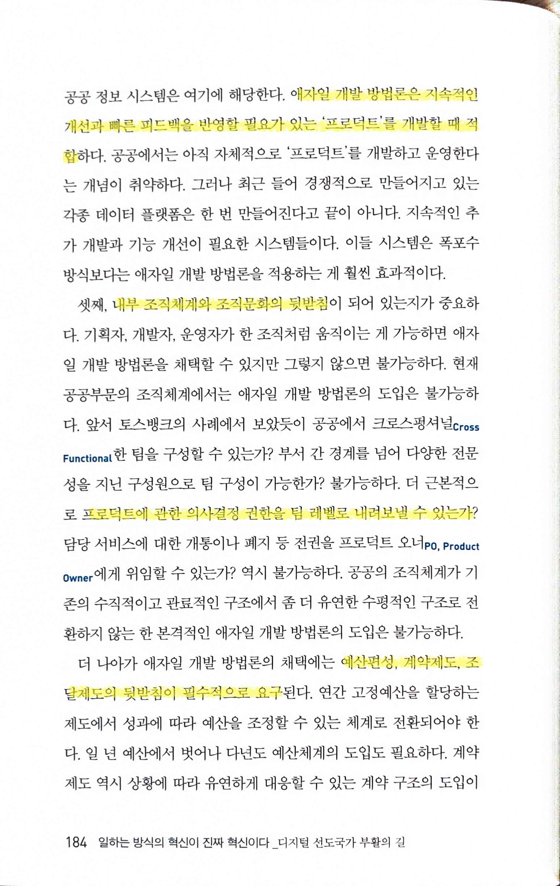
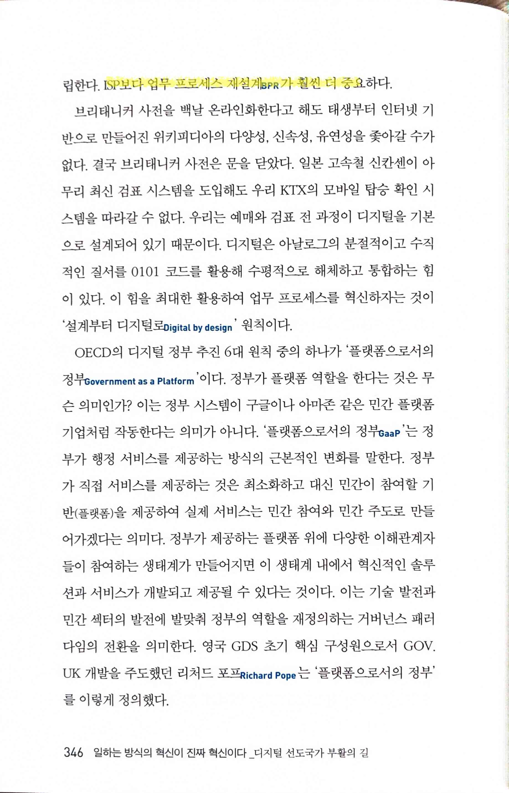
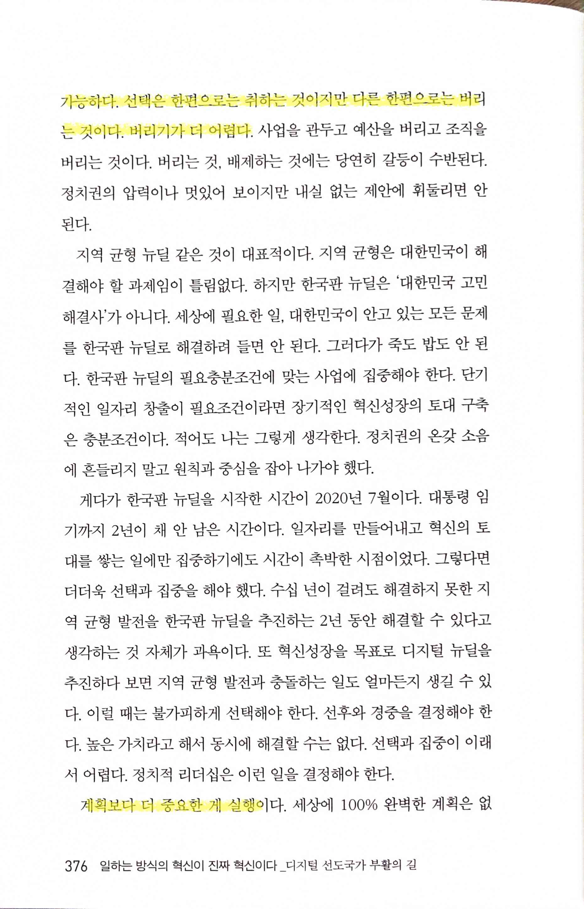

# 일하는 방식의 혁신이 진짜 혁신이다

Tags: management
Date: April 26, 2025 → April 27, 2025
Score: ★★★☆☆

- ★★★☆☆ April 26, 2025 → April 27, 2025
    - [나라를 위해서 일한다는 거짓말](https://www.notion.so/1a93f0c2cf65801dad63fce08bc2d714?pvs=21) 과 유사한 내용이지만 퇴직 후 소회를 쓴 느낌이 아니라, 제대로 된 일을 하기 위해 정책 제언을 하는 느낌이라 좀 더 내용이 구체적이고 문제 해결을 목표로 대안을 제시하는 점이 인상적이다. 국문과 출신의 사무관, 관료 출신과 성공한 IT 서비스를 두 개나 성공시킨 CEO 출신의 NIA 원장 출신이란 점 역시 내용의 차이를 만들었다.
    - 저자는 우리나라가 한때 정보화 선진국이었지만, 현재는 낡은 레거시 시스템과 관행, ‘승자의 저주’에 갇혀 혁신이 정체되었다고 진단한다. 디지털 전환, AI 도입 등 새로운 기술 환경에 맞춰 정부와 공공 기관이 일하는 방식 자체를 근본적으로 바꿔야 한다고 강조한다. 예를 들어, 애자일 방법론이 만능은 아니지만, 필요한 부분에는 적용이 필요하다고 하는 부분은, 그래도 나름 이쪽을 안다고 생각하는 내가 보기에, 적절한 제언이다. 폭포수를 무조건 배제하고 애자일을 도입해야 한다는 주장이 아니다. 기술, 제도 도입이나 종합 대책이 아니라 일하는 방식 자체의 혁신이 진짜 혁신임을 역설한다.
    - 개인적으로는 개발자 출신이란 배경 때문에 저자의 주장에 공감이 가지만, 너무나 경직된 관료 사회에 과연 변화가 가능할까하는 의심이 든다. 대다수 우리나라 공무원들의 유능함은 의심하지 않지만, 정무직 출신에 의해 방향이 휘둘릴 수 밖에 없는 현실의 벽은 정말 높고, 상의하달식 조직 구조로 인해 사회의 변화도 쫓기 어려운데 기술의 변화를 따라간다는 건 어림도 없는 일이다. 저자도 정책 추진 과정에서 직접 경험한 한계나 실패, 원인을 솔직히 기술했다.
    - [실리콘밸리 프로세스의 힘 The Power of Process](https://www.notion.so/The-Power-of-Process-1dd3f0c2cf65809c97dddb3a70b0fa98?pvs=21) 의 읽으면서 역시 시스템으로 바꿔야 한단 생각을 하던 중이었으나, “일하는 방식의 변화”라는 건 저자의 말처럼 근본적인 변화라 시스템만으로는 저자가 겪었듯 역부족이다. 작은 변화도 귀찮아하는게 사람이라 (좋건 나쁘건) 수십년 동작한 조직의 업무 방식은 속성상 비범한 리더가 있어야 조금이라도 변화할 수 있을텐데, 이건 시스템으로 어떻게 할 수 있는 영역이 아니기 때문(후반부에 나오듯 현 정부들어 망가진 수많은 영역을 생각해보면)에 어쩔 수 없이 의구심부터 든다. 과연 다음 정부에선 변화가 있을까? 기대해봐도 될까?
    - https://www.youtube.com/watch?v=1w-JWkOrRkY
    - https://www.youtube.com/watch?v=b-VeJHuoNhw
    - https://www.youtube.com/watch?v=C4nXnxWPF8Q
    - https://www.youtube.com/watch?v=PS0jJ8H6jSA
- p17
    
    
    
    - 과거의 성공을 바탕으로 구축되어 현재까지 뿌리박혀 있는 기존 체계를 보통 레거시Legacy 시스템이라고 한다. 대한민국 국가정보화의 위기는 역설적으로 레거시 시스템이 너무나도 유능했기 때문이다. 지금까지 레거시가 너무나 잘 작동하니까 급변하는 환경에 맞는 변화와 혁신을 제때 이루지 못했다. 레거시의 역설이자 승자의 저주
- pp18~19
    
    
    
    
    
    - 시대 변화에 맞게 시스템을 혁신해내는 국가 운영관리 능력의 문제
    - 혁신은 혁신 종합계획에서 나오지 않는다. 새로운 혁신적인 기술을 도입한다고 해서 혁신이 이루어지는 것도 아니다. 일하는 방식의 혁신이 진짜 혁신
    - 진실은 항상 구체적인 것에 있다고 믿기 때문이다. 내가 가장 싫어하는 것이 대안 없는 비판이다. 원론적으로 옳은 얘기만을 반복하는 이유는 지적 게으름 때문
        - → 반면 대안 없이 비판만 하지 말라고 하면 많은 구성원들이 아예 발언하지 않는 경우가 많다는 점은 어떻게 생각할지 궁금하다
    - 새로운 조직이 수많은 혁신을 만 들어낸 것이 아니라 새로운 조직을 만들어낸 것 자체가 혁신의 산물… 영국과 미국의 전문 기술 지원조직의 개발 가이드라인이 모두 '고객의 요구를 이해하라.’ 에서 시작 해서 '공개를 기본원칙으로 하라.'로 끝나는 것은 새로운 발견
- p77
    
    
    
    - 아웃풋output과 아웃컴outcome의 차이를 인식하는 게 중요... 아웃풋은 우리말로 산출물… 모두 양적 지표들이고 쉽게 측정할 수… 아웃컴은 우리말로 '실질성과'… 변화의 성과는 대부분 장기적으로 나타나기 때문에 성과를 측정하기가 쉽지 않다
- pp120~121 역시 문제의 원인을 만들었던 이명박 정부 시절의 정보통신부 해체. 아직도 당시 기억이 좀 난다.
    
    
    
    
    
- pp127~128
    
    
    
    
    
    - 리드 호프먼은 이런 인재 채용 방식을 '투어 오브 듀티tour of duty' 모델이라고 개념화했다. 우리말로 하면 '한시적 임무 수행 모델’
        - [Tours of Duty: The New Employer-Employee Compact](https://hbr.org/2013/06/tours-of-duty-the-new-employer-employee-compact)
        - [Introducing the tour of duty concept | LinkedIn Learning](https://www.linkedin.com/learning/reid-hoffman-and-chris-yeh-on-creating-an-alliance-with-employees/introducing-the-tour-of-duty-concept)
    - 혁신적인 조직 운영 없이 혁신적인 업무성과는 나올 수 없다
- pp130~131
    
    
    
    - 일하는 방식의 변화가 진정한 혁신이고, 이 혁신이 성과를 창출하는 원동력... 질문을 잘해야 원하는 답을 얻을 수 있다. 실천적인 문제의식이 있어야 벤치마킹도 가능
    - 조직이 낳은 혁신적 성과 이전에 GDS라는 형태의 조직을 만들기로 한 결정 자체가 더 혁신적
    
    
    
    - "모든 이론은 회색이요, 오직 영원한 것은 저 푸른 생명의 나무다.”
        - https://www.goodwriter.or.kr/bbs/board.php?bo_table=s0409&wr_id=7
        - All theory is gray, my friend. But forever green is the tree of life
            - [https://www.goodreads.com/quotes/398427-all-theory-is-gray-my-friend-but-forever-green-is](https://www.goodreads.com/quotes/398427-all-theory-is-gray-my-friend-but-forever-green-is)
- pp145~149
    
    
    
    - 디지털 전문조직은 디지털 전문조직답게 일해야 한다… 걸맞은 조직 운영 방식, 문제 해결 방식, 프로젝트 수행 방식… 원칙과 철학… 신기술을 흉내 내는 것이 혁신이 아니고 일하는 방식의 혁신이 진정한 혁신
    
    
    
    - 작게 시작해서 단위 모듈 개발을 반복하고, 반복하고, 반복하고, 또 반복
    
    
    
    - 일관되게 애자일 개발 방법론을 고수했다. 작게 시작해서 빠르게 프로토타입을 만들었다. 이후 반복에 반복을 거쳐 계속해서 프로덕트의 완성도를 높여갔다… '전략계획' '마스터플랜'을 수립하려 하지 않았다. 오히려 작은 실행을 반복하면서 전략을 완성... 전략이 먼저 있고 실행이 뒤따른 것이 아니 라 애자일한 접근방식 아래 실행을 우선… '왜 배포가 전략이 되는기why the strategy is delivery'
    - 가장 중시한 것이 '고객의 요구'를 듣는 것이었다(Focus on user need!). 모든 일의 시작은 고객 요구의 파악에서 출발
    - 기존의 개발 프로세스가 완전히 뒤바뀌는 것
    
    
    
    - GDS가 발표한 디자인 원칙 10개 조항의 첫 항이 '사용자 니즈에서 출발하라’
    
    
    
    - 출범 자체가 혁신적인 접근의 산물… 일하는 방식을 혁신함으로써 성공
    - [https://publicpolicydesign.blog.gov.uk/2023/02/23/the-strategy-is-delivery/](https://publicpolicydesign.blog.gov.uk/2023/02/23/the-strategy-is-delivery/)
    - [https://www.amazon.com/Digital-Transformation-Scale-Strategy-Perspectives/dp/1907994785](https://www.amazon.com/Digital-Transformation-Scale-Strategy-Perspectives/dp/1907994785)
- p152
    
    
    
    - '메모가 아닌 데모'… '한 장의 그림이 천 마디 말의 가치가 있고, 실제 작동하는 코드는 백만 마디 말의 가치가 있다… 어떤 양의 슬라이드, 개요, 또는 문서도 실제로 작동하는 것을 보는 것만큼 문제를 바라보는 시각을 바꿀 수 없습니다. 실제로 무언가를 만지고 사용해 볼 수 있는 것은 단순히 생각뿐만 아니라 사고방식 자체를 바꿉니다. 배포가 바로 전략입니다!Delivery is strategy!
    항상 배포하라.
        - '메모가 아닌 데모'… '배포가 곧 전략'… 조직 운영에 린 방식을 적용하는 것은 스타트업과 혁신조직의 기본 작동 원리
- pp161~164
    
    
    
    - 불과 6주 만에 복잡하게 꼬인 시스템의 문제를 해결… 방법론의 혁신이 결정적인 역할
    
    
    
    - '가장 많은 수의, 가장 필요로 하는 사람들에게 가장 큰 차이를 만들어 낼 수 있는 것은 무엇인가가 가장 중요하다.’
    
    
    
    - 사용자의 요구, 단순함의 추구, 데이터 기반, 애자일한 반복 실행 등 핵심 키워드가 같다. 특히 USDS의 개발 전략과 GDS의 디자인 원칙은 시작과 끝이 같은 구조
    
    
    
    - 조달의 혁신 없이 디지털 혁신은 불가능. 애자일한 조달 없이 애자일한 개발은 있을 수가 없다
- pp165~166
    
    
    
    - 눈여겨봐야 할 것은 조직과 제도 너머에 있는 철학, 원칙, 문화… 항상 고객의 요구에서 출발한다. 조직 이든 프로젝트든 작게 시작한다. 검증과 추가 개발을 끝없이 반복하면서 알파 버전에서 베타 버전으로 나아간다. 계획보다 실행과 배포를 중시… 모든 과정과 결과물은 공개를 원칙
    - '린 스타트업' 방법론을 프로그램 설계뿐만이 아니라 조직 설계에도 적용... 조직 자체가 '구축- 측정-학습-반복'이라는 피드백 루프 위에서 작동해야 한다. 그래야 실험, 진화, 지속적인 반복, 개선의 문화가 자리 잡을 수 있다… 실패를 용인하는 문화 없이 과감한 혁신은 불가능
    
    
    
- p172
    
    
    
    - 새로운 개발 방법론의 수용은 단지 새로운 기술의 채택에 국한되는 문제가 아니다. 기술을 뒷받침할 조직체계와 조직문화가 있을 때 가능
    - 폭포수 방식을 선택하는지 애자일 개발 방법론을 선택하는지가 중요하지 않다. 원하는 결과를 만들어내면 된다… 애자일 개발 방법론은 기획, 개발, 운영의 일관된 조직체계가 보장되지 않으면 작동할 수가 없다
- pp182~185
    
    
    
    - 폭포수 방식이 적합한 프로젝트들은 대체로 다음과 같은 특성
    - 빠른 변화와 지속적인 업데이트가 필요한 프로젝트에는 당연히 애자일 개발 방법론이 적합
    
    
    
    - 프로젝트project와 프로덕트product의 차이를 구별… 프로젝트는 특정 목표를 달성하기 위한 시작과 끝이 정해져 있는 작업… 프로덕트는 계속해서 가치를 제공하는 제품이나 서비스… 폭포수 모델은 요구사항이 명확하고 변경이 적은 '프로젝트'를 수행할 때 적합
    
    
    
    - 애자일 개발 방법론은 지속적인 개선과 빠른 피드백을 반영할 필요가 있는 '프로덕트'를 개발할 때 적합
    - 내부 조직체계와 조직문화의 뒷받침… 프로덕트에 관한 의사결정 권한을 팀 레벨로 내려보낼 수 있는가?
    - 예산편성, 계약제도, 조달제도의 뒷받침이 필수적으로 요구
    
    
    
    - 새로운 개발 방법론의 도입은 기존 제도와 조직은 그대로 두고서 새로운 기술을 도입하는 일이 아니다. 개발 방식을 바꾸는 일이 아니라 공공의 기존 제도, 조직, 관행, 문화를 바꾸는 일이다. 일하는 방식을 근본적으로 바꾸는 일이다. 디지털 전환 시대에 디지털의 장점이 극대화되도록 정부 자체를 바꾸는 일
- pp207~214
    
    
    
    - 디지털 고객 경험... "디지털은 고객의 모든 기대를 현실화했고 모든 것을 원하는 고객을 만들었다."
    - 디지털로 바꾼다는 것은 사람들이 원하는 것을 다 해줘야 하고 그것이 당연한 고객의 기대
    
    
    
    - 디지털 고객 경험에 대한 이해에서 가장 중요한 것은 서비스의 가치는 기능성과 고객 경험의 곱셈으로 표시
    - 사용자들이 원하는 것... '심플한 고객 경험'은 스티브 크룩의 저서 『사용자를 생각하게 하지 마』... 사용자들은 원하는 목표만 쉽고 빠르게 도달하기를 원할 뿐 다른 것들은 별로 관심이 없다.
    - 심플할수록 더 많은 사용자가 사용… 조금이라도 더 심플하게 만들수록 더 많은 사용자가 사용하는 제품이 된다
    
    
    
    - 심플하지 않은 고객 경험을 제공하면 각 단계가 넘어갈 때마다 사람들의 트래픽이 굉장히 급격하게 감소
    - 심플한 고객 경험은 목표 달성을 위한 절차가 짧고, 각 단계에서 어려움이 없다
    
    
    
    - 두 번째, 여러 부류의 사용자와 사용 맥락을 모두 고려
    
    
    
    - "심플리시티가 궁극적인 세련미sophistication이다."… "복잡한 것보다 심플한 게 훨씬 더 어렵다. 하지만 심플함을 달성하고 나면 산도 움직일 수 있다."
    - 고객의 경험이 심플하다는 것은 소프트웨어가 해주는 것 이 많다는 뜻
    
    
    
    - ‘용어’ 문제
    
    
    
    
    
- p224
    
    
    
    - '플랫폼에 완성은 없다. 발전과 성장만이 있을 뿐이다.’
- p248
    
    
    
    - 인간의 진실은 제각기 주관적이다. 결국 정책 수립을 위해서는 기술, 산업, 공공, 이 세 가지 시각을 종합해야만 한다.
        - → CTO로 일할 때 내부 고객에 해당하는 비즈니스 부서와의 협업을 생각해보면 정말 힘들었지만 분명히 필요한 일이었고, 시간이 걸렸지만 성과가 나긴 했다
- pp315~316
    
    
    
    - 공개Disclosure는 청구인의 요청에 따라 특정 정보를 제공하는 것이 주목적
    
    
    
    - 개방Open은 데이터를 누구나 자유롭게 접근하고 사용할 수 있도록 하는 것
- pp338~339
    
    
    
    
    
    - 윤석열 정부는 너무 무모해서 탈이고 문재인 정부는 너무 신중해서 탈
- pp345~346
    
    
    
    - OECD가 제시한 게 디지털 정부 추진 6가지 원칙
    - 가장 중요한 원칙이 '설계부터 디지털로Digital by design' 원칙… 업무 프로세스 재설계BPR, Business Process Reengineering… 업무 프로세스 재설계BPR는 디지털 기술을 활용하여 업무 프로세스를 개선하는 게 핵심이다. ISP는 조직의 전략적 목표에 맞춰 정보시스템 구축계획을 수립
    
    
    
    - ISP보다 업무 프로세스 재설계BPR가 훨씬 더 중요
- p355
    
    
    
    - 망가진 건 한 두가지가 아니었다. 삼성의 일이기도 하지만 사실 이 정도되는 사람은 국가에서 관리하는 체계가 있는데 중국으로 옮겼다는 것만 봐도 현 상황이 잘 드러난다.
        - https://www.scmp.com/news/china/science/article/3308336/chinese-university-recruits-south-korean-semiconductor-expert-lee-young-hee
- p363
    
    
    
    - 전략이란 평범하면서도 중요한 것들, 기본을 이루는 것들
- p374
    
    
    
    - 이세돌은 바둑에서 가장 중요한 것이 복기하는 과정
- pp375~377
    
    
    
    - 모든 사업 성공의 요체는 선택과 집중에 있다. 그러나 이게 말은 쉽지만 실행은 전혀 쉽지 않다. 선택과 집중은 리더십이 뒷받침되어야 가능하다. 선택은 한편으로는 취하는 것이지만 다른 한편으로는 버리는 것이다. 버리기가 더 어렵다.
        - → 그래서 뭐든 simple하게 하기 어렵다. 언제나 내가 ‘있으면 좋을 거 같다’는 건 하지 말자고 주장하는 이유. ‘없으면 안 되는 걸’하는 거도 어렵기 때문
    
    
    
    - 계획보다 더 중요한 게 실행… 전체적인 방향이 옳다면 부족한 것은 실행하면서 보완하면 된다. 그래야 속도감 있는 사업추진이 가능
    
    
    
- p384
    
    
    
    - https://aihub.or.kr/
- pp398~399
    
    
    
    - 한국판 뉴딜은 마스터플랜과 전략계획이 뒤섞여 있는 걸로 보인다.
    
    
    
    - 시간과 자원의 제약 속에서는 전략목표에 집중해야 한다. 마스터플랜은 아름다울 수 있으나 전략계획은 아름다울 수 없다. 전략계획은 갈등과 다툼의 산물이기 때문이다. 서로 중요하다고 아우성치는 것들 속에서 버리고 자르고 싸워서 마지막에 살아남는 것이 전략목표이자 전략계획이 되어야 한다.
- p404
    
    
    
    - 근본적인 문제점을 찾아 해결책을 제시하는 것은 상대적으로 수월할 수 있다. 정작 어려운 것은 아무리 작은 일이라도 일관된 방향으로 해결책을 실행에 옮기는 일
- p409
    
    
    
    - 승자의 저주Winner's Curse... 과거의 성공이 미래를 보장해주지 않는다.
    - 시대가 바뀌면 과거에 레거시가 지닌 장점은 그대로 현재의 단점
- p413
    
    
    
    - 정부 시스템이 제대로 작동하지 않는다. 기술의 문제나 개발자의 문제가 아니다. 정부가 일하는 제도적 기반을 바꾸는 게 가장 중요... "과거와 같은 방식으로 일하면서 다른 결과를 기대하는 것은 미친 짓이다."
- pp436~437
    
    
    
    - 성공요건… 목적이 분명하고 범위가 구체적… 효과적으로 운영
    
    
    
    - 기획과 실행은 분리될 수 있지만 어떻게 기획 업무가 따로 놀 수가 있는가?
