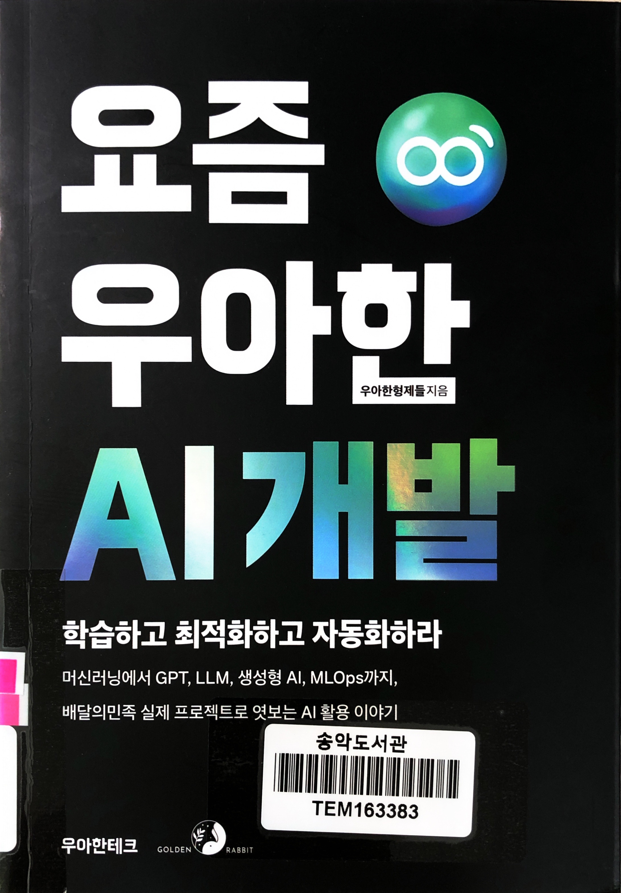
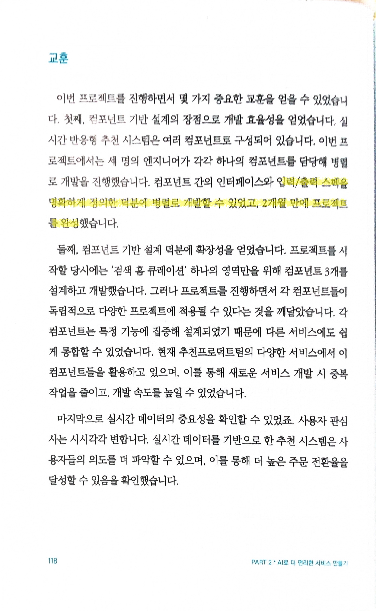
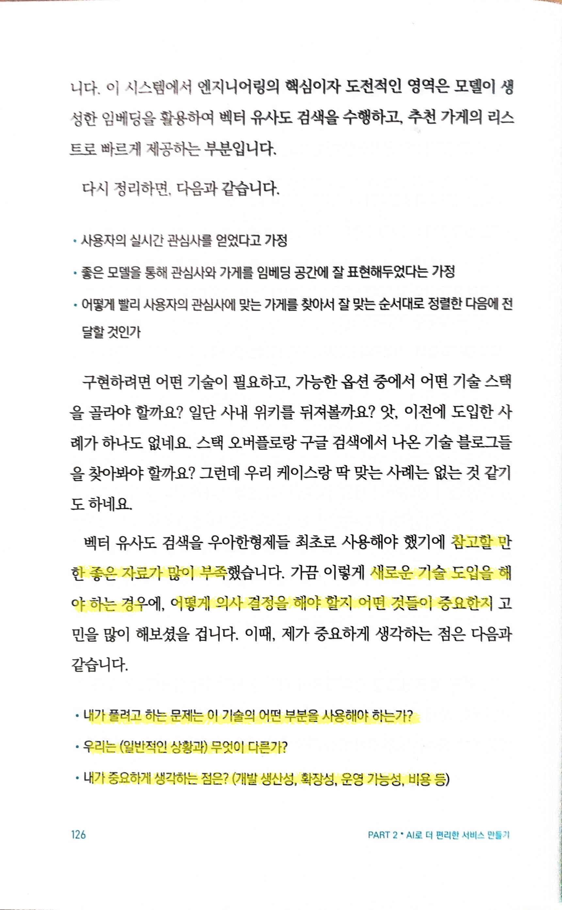
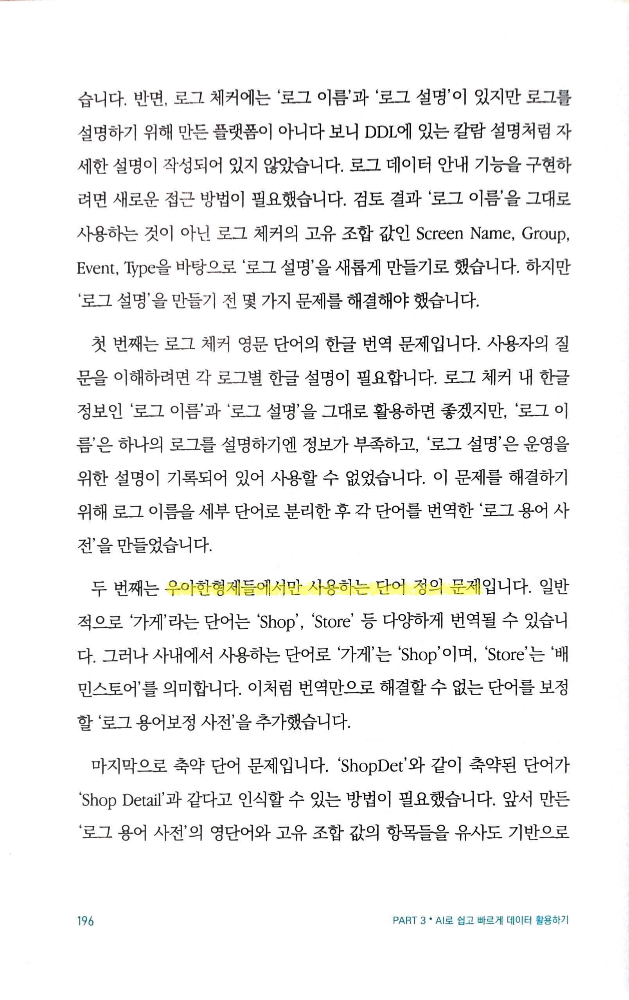

# 요즘 우아한 AI 개발

Tags: artificial-intelligence, devrel, software-engineering
Date: June 2, 2025
Score: ★★★★☆

- ★★★★☆ June 2, 2025
    - 우아한형제들이 실제 현장에서 AI를 어떻게 활용하고, 서비스에 적용해왔는지 생생하게 담아낸 책이다. ‘요즘 우아한 개발’에 이어 두 번째로, AI를 중심으로 데이터·로봇 등 최신 기술을 활용한 사내 개발 사례를 엮었다.
    - 실제 프로젝트에서 겪은 시행착오와 고민, 그리고 그 해결 과정을 공개 가능한 선에서 솔직하게 기록했다. AI 추천 시스템, 데이터 분석 자동화, 로봇 머신러닝 모델 경량화, MLOps 구축 등 다양한 분야에서 직접 경험한 노하우와 인사이트가 가득하다.
    - 비즈니스적으로는 최근 소상공인 수수료 논란 등 비판도 있지만, 개발 관점에서 우아한형제들은 국내에서 보기 드문 실전 적용 사례를 꾸준히 공개하며, 업계 기술 발전과 공유 문화 확산에 크게 기여한다는 생각이다. 이 책은 이런 가치 있는 테크 브랜딩의 또 하나의 모범 사례라고 본다.
- p118 어떤 일을 하더라도 중요한 부분. ‘명확’한 ‘정의’가 있어야 일을 빠르게 진행할 수 있다. 누구나 아는 거 같지만, 사실 의외로 이걸 잘 모른다.
    
    
    
- p126 참고 자료는 부족한데, 새로운 기술을 도입하는 의사 결정을 해야 할 때
    
    
    
- p196 domain knowledge의 중요함. 결국 데이터의 문제. 데이터를 어떻게 수집하고 활용할지
    
    