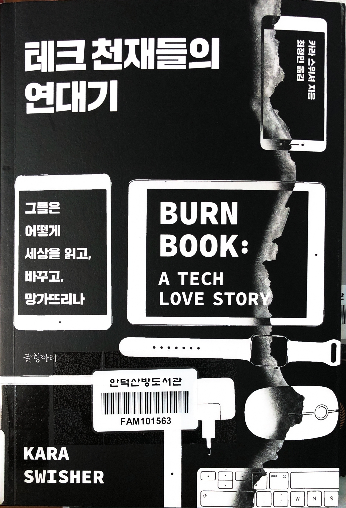
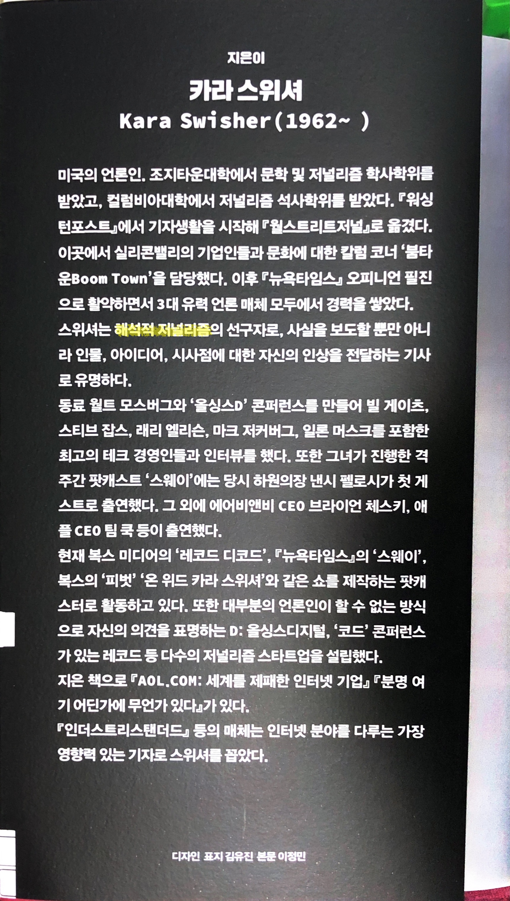
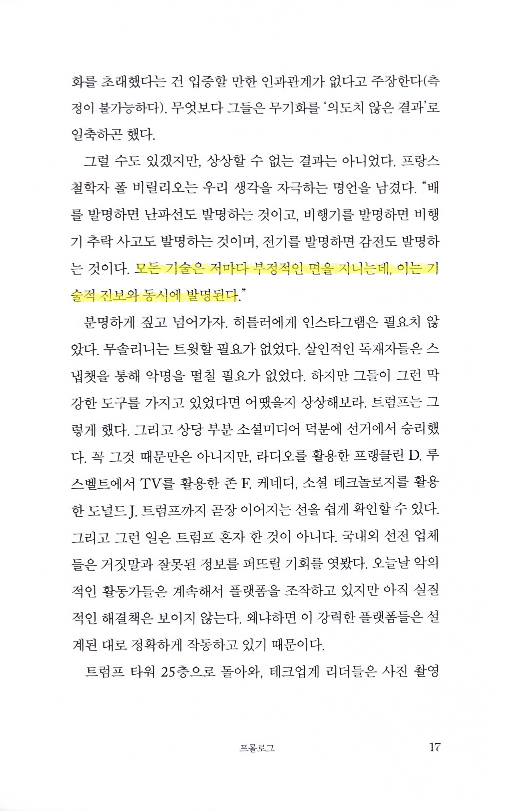
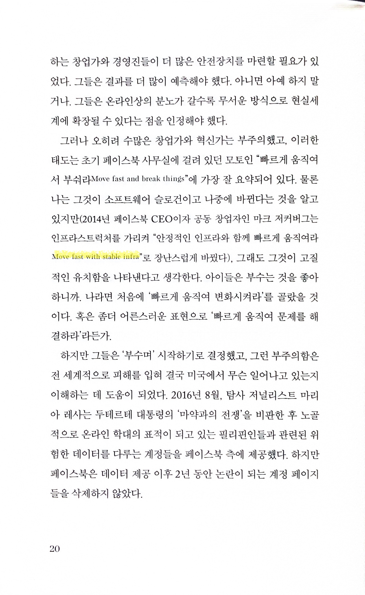
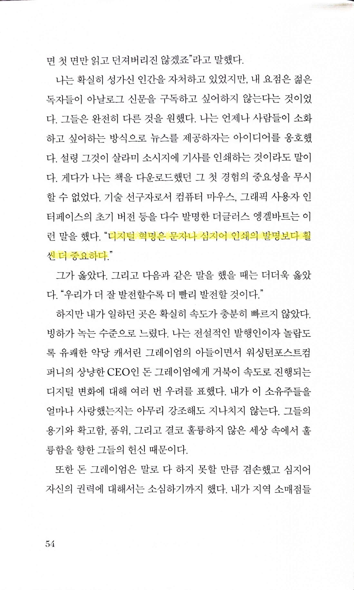
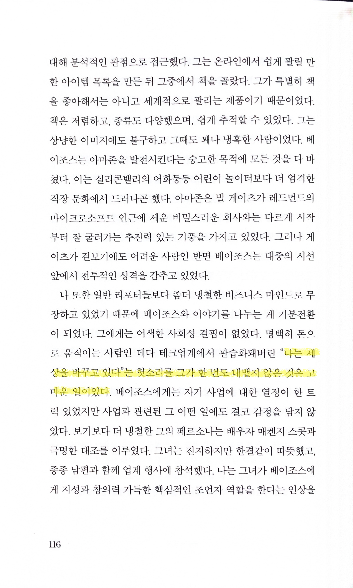

# 테크 천재들의 연대기 Burn book: A tech love story

Tags: essay
Date: June 8, 2025
Score: ★★☆☆☆

- ★★☆☆☆ June 8, 2025
    - 약 1/3 정도 읽다가 책을 덮었다. 이 책은 실리콘밸리의 대표적인 거물들—마크 저커버그, 일론 머스크, 빌 게이츠, 스티브 잡스, 제프 베이조스, 제리 양, 트래비스 캘러닉 등—의 민낯과 그들이 이끌어온 테크 업계의 현실을 신랄하게 해부(한다고)하는 책이다.
    - 책 표지에 ‘해석적 저널리즘’이라는 말이 적혀 있는데, 저자는 단순한 사실 나열이 아니라 자신의 시각과 해석을 적극적으로 녹여낸다. 실제로 구글, 페이스북, 우버 등 거대 IT 기업들이 세상을 어떻게 바꿨는지, 그리고 그 과정에서 어떤 문제점과 부작용이 있었는지 거침없이 비판한다. 테크 CEO들의 혁신성과 성격, 그리고 그들이 남긴 빛과 그림자를 비교하는 대목들도 흥미롭다.
    - 하지만 저자의 개인적인 경험과 감정, 자신에 대한 이야기가 생각보다 많이 등장한다는 점이 아쉬웠다. 테크 업계의 인물과 사건이 궁금한데, 저자의 사적인 에피소드가 자주 섞여 나오다 보니 읽는 흐름이 자꾸 끊긴다는 느낌을 받았다. 물론 저자 특유의 해석과 시선이 책의 개성이긴 하지만, 저자 자신에 대해 관심을 갖는 건 아니라 나와 비슷한 시각이 있는 독자들에겐 호불호가 갈릴 수 있을 것 같다.
    - 아직 다 읽지는 않았지만, 잠시 쉬었다가 다시 읽어볼 생각이다. 테크 업계의 빛과 그림자, 그리고 그 이면에 숨겨진 인간적인 이야기가 궁금하고, 다소 개인적인 저자의 이야기가 섞이는 게 불편하지 않다면 한 번쯤 도전해볼 만한 책이라고 생각한다.
        
    - https://www.thescoop.co.kr/news/articleView.html?idxno=305442
- 책표지
    
    
    
- p17
    
    
    
- p20 ‘장난스럽게’라고 써있지만 빠른 실험과 feature deployment를 위해서는 stable infra는 필수이긴 하다
    
    
    
- p54
    
    
    
- p116
    
    
